# Introducción

## ¿Qué es android?

Es un sistema operativo desarrollado actualmente por Google que se distingue por ser **una pila de software de código abierto basado en Linux creada para una variedad amplia de dispositivos.**

Fue diseñado principalmente para dispositivos móviles con pantalla táctil, como teléfonos inteligentes y tabletas y posteriormente para relojes inteligentes, televisores y automóviles.

## Historia

### Open source

El Open source es un modelo de desarrollo de software que como su nombre lo indica permite el acceso al código fuente de algún sistema o programa para se pueda modificar a la conveniencia de otros desarrolladores.

### Open Handset Alliance (OHA)

La OHA es una alianza comercial que se dedica a desarrollar estándares abiertos para dispositivos móviles, entre sus miembros destacan Google, HTC, Motorola, Qualcomm, Samsung, Dell, Intel, Nvidia y muchos más. 

La OHA se creo al mismo tiempo que Google empezó a mantener el desarrollo de Android y los miembros de dicha alianza participan activamente en la innvoación de dicho sistema operativo.

### El nacimiento de Android

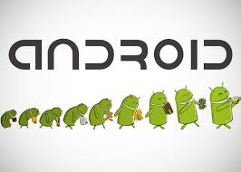

El origen de Android se remonta a una persona en particular, se trata de **Andy Rubin**, un licenciado en ciencias de la computación que inició trabajando en una empresa que surgió de **Apple** llamada General Magic, trabajando en un proyecto que pretendía ser un sistema operativo para teléfonos o PDAs, llamado Magic Cup; sin embargo, dicho proyecto jamás funcionó, al grado de que la empresa quebrara.
Con un poco de experiencia y con algunos otros trabajos que tuvo posteriormente, decidió crear su propia empresa llamada **Danger Inc**, la cual posteriormente fue comprada por Microsoft. Durante ese tiempo fungió como CEO de la compañía logrando introducir al mercado un teléfono llamado Hiptop, que sería uno de los primeros pasos de los smartphones.

No fue sino hasta el año 2003 cuando Andy Rubin se deslinda totalmente de Danger Inc y decide fundar la compañía Android Inc.

Android fue desarrollado por Android Inc., que **Google** respaldó económicamente en su momento y que más tarde compró en el 2005. La compañía original era de Palo Alto, California (fundada en 2003). Entre los cofundadores de Android que se fueron a trabajar a Google están Andy Rubin (co-fundador de Danger), Rich Miner (co-fundador de Wildfire Communications, Inc.), Nick Sears (alguna vez VP en T-Mobile), y Chris White (quien encabezó el diseño y el desarrollo de la interfaz en WebTV). 

**Android** se presentó en el 2007 junto con la **Open Handset Alliance**, se presento como un proyecto de código abierto bajo el nombre de **Android Open Source Project (AOSP)** y bajo la licencia **Apache**.

### ¿Por qué se llama Android?

**Versión 1**

El nombre Android hacen alusión a la novela de Philip K. Dick ¿Sueñan los androides con ovejas eléctricas?, que posteriormente fue adaptada al cine como *Blade Runner*. Tanto el libro como la película se centran en un grupo de androides llamados *replicantes* del modelo Nexus 6 (Por ello Google bautiza así a uno de sus dispositivos móviles).

**Versión 2**

Andy Rubin trabajó en Apple en 1989 como ingeniero de software, y desde niño siempre sintió pasión por la robótica, y Apple era el lugar perfecto para expresar muchos de sus intereses, por lo que sus compañeros lo apodaron Android.

### ¿Y la mascota?

El nombre del logotipo es “Andy”.

### Otras curiosidades menos comunes

* El logotipo de la palabra Android fue diseñado con la fuente Droid, hecha por Ascender Corporation. 

* El verde es el color del robot de Android que distingue al sistema operativo. El color print es PMS 376C y color GBN en hexadecimal es #A4C639, como se específica en la Android Brand Guidelines. 

* La tipografía de Android se llama Norad, solo usado en el texto del logo. 

* Para Ice Cream Sandwich se introduce una tipografía llamada Roboto, que, según los propios creadores, está pensada para aprovechar mejor la legibilidad en los dispositivos de alta resolución.

## Versiones de Android

| Letra | Nombre             | Versión             |
| ----- | ------------------ | ------------------- |
| A     | Apple Pie          | 1.0                 |
| B     | Banana Bread       | 1.1                 |
| C     | Cupcake            | 1.5                 |
| D     | Donut              | 1.6                 |
| E     | Éclair             | 2.0/2.1             |
| F     | Froyo              | 2.2                 |
| G     | Gingerbread        | 2.3                 |
| H     | Honeycomb          | 3.0/3.1/3.2         |
| I     | ice Cream Sandwich | 4.0                 |
| J     | Jelly Bean         | 4.1/4.2/4.3         |
| K     | KitKat             | 4.4                 |
| L     | LolliPop           | 5.0/5.1             |
| M     | Marshmallow        | 6.0/6.01            |
| N     | Nougat             | 7.0/7.1/7.1.1/7.1.2 |
| O     | Oreo               | 8.0/8.1             |
| P     | Pie                | 9.0                 |

Wikipedia nos proporciona la siguiente tabla respecto de las versiones de Android

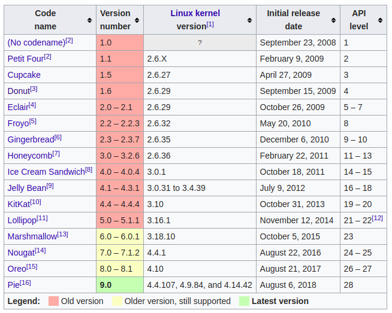

### ¿Por qué las versiones de android tienen nombre de pastelillos?

Google se ha mostrado siempre muy reservado cada vez que se le ha preguntado por el tema. En una ocasión, el portavoz de Google, Randall Sarafa, respondió a esta cuestión explicando que se trataba de una **broma interna** que comenzó con Android 1.5 Cupcake, y que ni siquiera él estaba muy seguro de dónde comenzó todo.

En la presentación de Android 4.4 KitKat, Google también explicó que la razón por la que todas **las versiones de Android traían nombres de dulces era porque los smartphones y tablets endulzan nuestra vida** y, entre estos, el chocolate es particularmente adictivo, siendo KitKat el favorito de la empresa. 

Google, además, no es la única compañía que utiliza un sistema de nombres de este tipo. **Apple pasó años poniéndole a su software OS X nombres de felinos** (Puma, Leopard, Lion...) y nunca reveló la razón por la que lo hacía. 

### Android 1.0 Apple Pie /Astroboy / Alpha

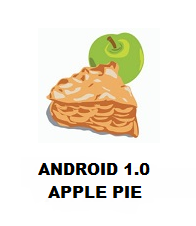

La primera versión comercial tenía mucho margen de mejora y apenas inquietó a la competencia, pero ya introducía algunos conceptos que años después son un estándar de los sistemas operativos móviles:

- Menú desplegable de notificaciones
- Widgets de escritorio
- Android Market, la tienda de apps (no contaba con ningún sistema de pago para usuarios. Todo el catálogo era gratuito)
- Integración con Google Mail, Contacts y Calendar
- Navegador, Maps, Google Talk, reproductor de YouTube y soporte para cámaras.

### Android 1.1 Banana Bread / Beta

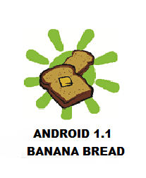

**Características**

Fue una actualización necesaria que llegó en febrero de 2009 con la intención de solucionar muchos de los bugs y errores de la primera versión de Android, la 1.0 Apple Pie.

### Android 1.5 Cupcake

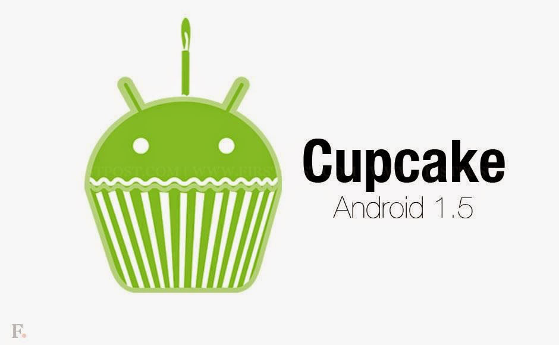

**Caracaterísticas**

Android 1.5 Cupcake sentó las bases de muchas características que se encuentran en Android hoy en día. Una de las más importantes es la posibilidad de realizar búsquedas desde la barra que se encuentra en el Home, la llegada de los Widgets o el teclado virtual con una vibración a la hora de teclear.

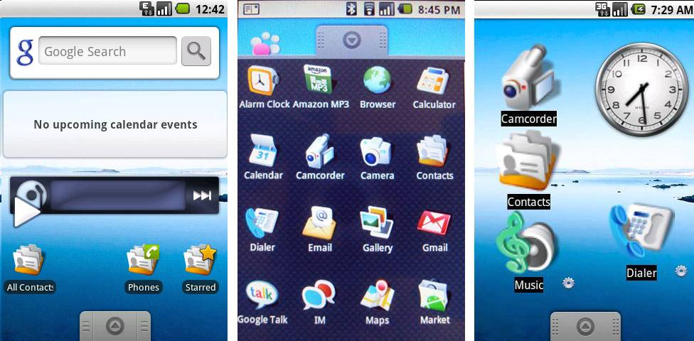

Otras características de esta versión incluyen la posibilidad de grabar videos en MP4 y 3GP, con la opción de subirlos a YouTube, la funcionalidad de copiar-pegar en el navegador, auto-rotación de pantalla y el auto-completado.

### Android 1.6 Donut

**Características**

El sistema operativo se adapta a las diferentes tamaños de pantalla

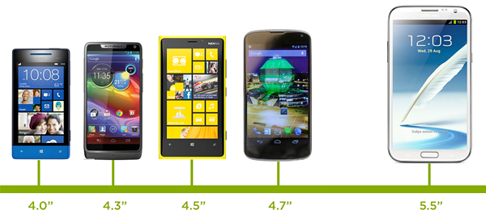

Se introduce un cuadro de búsqueda rápida que muestra los resultados del contenido local del teléfono y además de la web.

Se introduce una aplicación llamada **android market** para poder descargar aplicaciones.!

### Android 2.0 Éclair

**Características**

Se implementa **Google Maps Navigation** lo cual le da un nuevo sentido a la definición de *smartphone*.

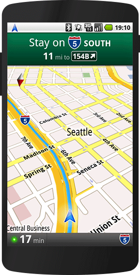

Se introduce la función **Speech-to-text** que es el antecedente de "OK Google", era un botón que estaba en el teclado para que puedieramos dictarle al teléfono en lugar de escribir.

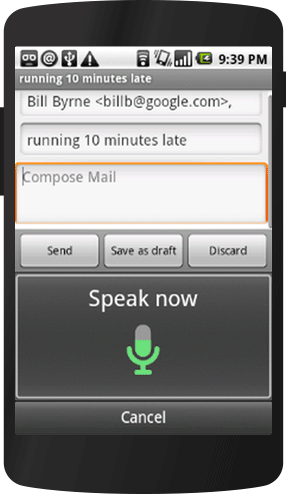

### Android 2.2 Froyo

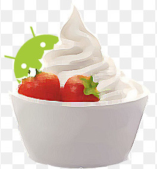

**Características**

Froyo permite convertir tu teléfono en un WI-FI hotspot portable, es decir, es posible compatir "Internet" a otras personas.

Con esta versión de Android se mejora el rendimiento del sistema operativo, se introduce algo llamado **Compilador Dalvik JIT**  que permite optimizar el rendimiento 5 veces más.

Además, la aplicación de voz mejora y permite que android ejecute ciertas acciones que nosotros expresamos por medio de nuestra voz.

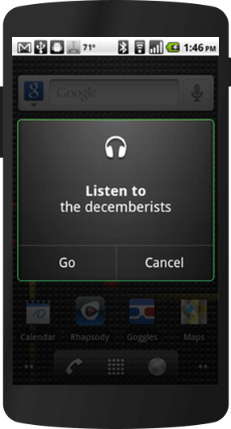

### Android 2.3 GingerBread

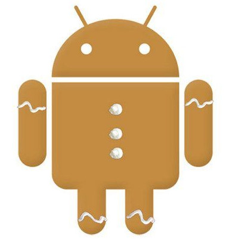

**Características**

Se introduce el manejo de batería que permite prolongar la vida de la misma. Android 2.3 permite ver exactamente como es que el sistema operativo y sus aplicaciones consumen nuestra batería.

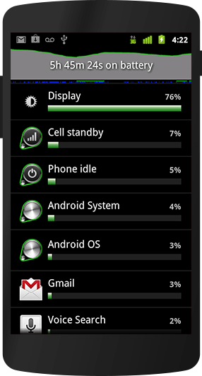

Se introduce una tecnología llamada **NFC** (Near Field Communication), que permite transmitir información entre dispositivos solo por el hecho de poner dos dispositivos cerca.

**GingerBread** introduce una API para poder desarrollar juegos con un mejor aprovechamiento de los gráficos del teléfono y con ello crear graficos en 3D y acceder al audio, controles y almacenamiento de una manera mucho más fácil.

### Android 3.0 HoneyComb

**Características**

Se introduce  un diseño más amigable para la tablet para permitir tener una mejor experiencia a la hora de leer liros, ver videos, etc.

Además, comienzan a desaparecer los botones físicos (el de inicio y el de retroceso) y se incluyen en la interfaz gráfica del usuario. 

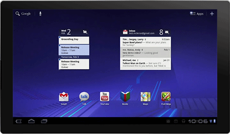

Se añaden las **configuraciones rápidas** que permiten modificar información esencial de manera práctica: la hora, la fecha, el estado de conexión.

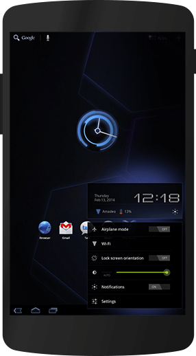

### Android 4.0 Ice cream sandwich

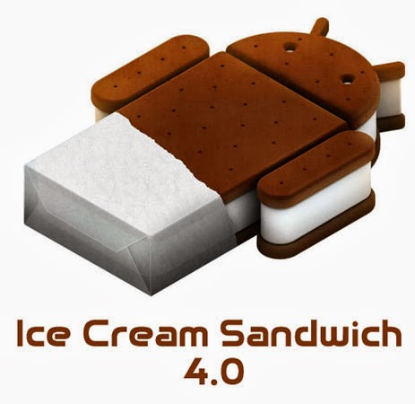

**Características**

Se añade un funcionalidad muy útil y requerida, el **control de uso de datos**, ya que a medida que los smartphones iban evolucionando, las compañias telefónicas ofrecían distintos paquetes de Conexión a internet y por ello se hace necesario tener una funcionalidad para que el usuario pueda ver como y en que se consumen estos servicios.

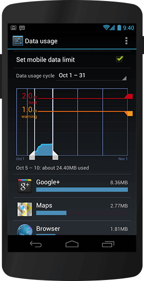

**Android Beam** fue una de las características más innovadoras de este sistema, utilizando tecnología NFC se podían pasar muchas cosas a otro dispositivo con el simple hecho de ponerlos juntos. Era posible pasar: aplicaciones, contactos, música, videos y un montón de cosas más.

### Android 4.1 Jelly Bean

**Características**
Con esta nueva versión de Android Google intenta ganar más terreno en nuestro día a día e introduce **Google Now**, un potente asistente para obtener la información que necesitamos en el menor tiempo posible.

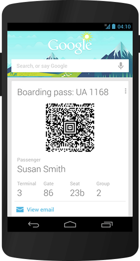

En esta versión de android se le da un giro a las notificaciones que en un versión anterior solían ser estáticas y ahora **accionables**, es decir, las notificaciones se pueden exapndir para mostrar más información o inclusive para responder desde allí.

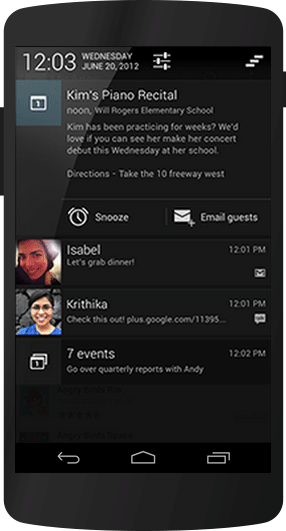

Además, Jelly Bean permite tener multiples usuarios en el mismo dispositivo y cada cuenta tiene su propia personalización de la pantalla de inicio, widgets, etc.

### Android 4.4 Kitcat

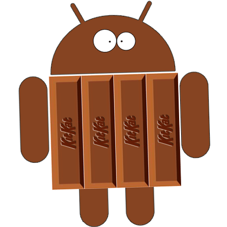

**Características**

Introduce un asistente más potente que todos los anteriores, **Ok Google**, sin necesidad de tocar la pantalla se puede hacer mucho, basta con simplemente decir "Ok, google" para poder hacer una búsqueda, enviar un mensaje, conseguir una dirección o inclusive reproduccir una canción.

Pensando en los usuarios, se introduce el **immersive design** cuya filosofía es esconder todo (barra de notificaciones, barra de control) excepto lo que realmente nos interesa ver.

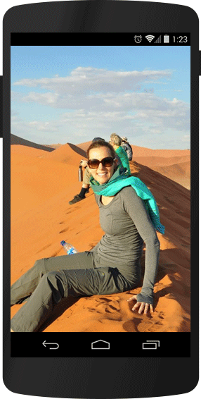

### Android 5.0 Lollipop

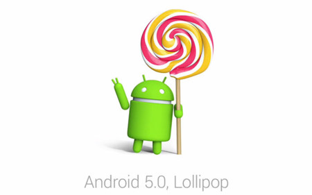

**Características**

Con esta versión de android se introduce un diseño más "moderno" y agradable con ayuda de **Material Design**.

Con Lollipop se introduce el **multiscreen**, que permite moverse entre diferentes dispositivos con sistema operativo android. Con lollipop es posible retormar las actividades realizadas en el smartphone (reproduccir canciones, photos, aplicaciones) en cualquier otro dispositivo android vinculado.

Ahora las notificaciones también se muestran en la pantalla de bloqueo y es posibles responderlas desde esta pantalla.

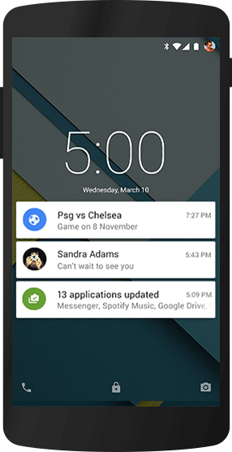

### Android 6.0 Marshmallow

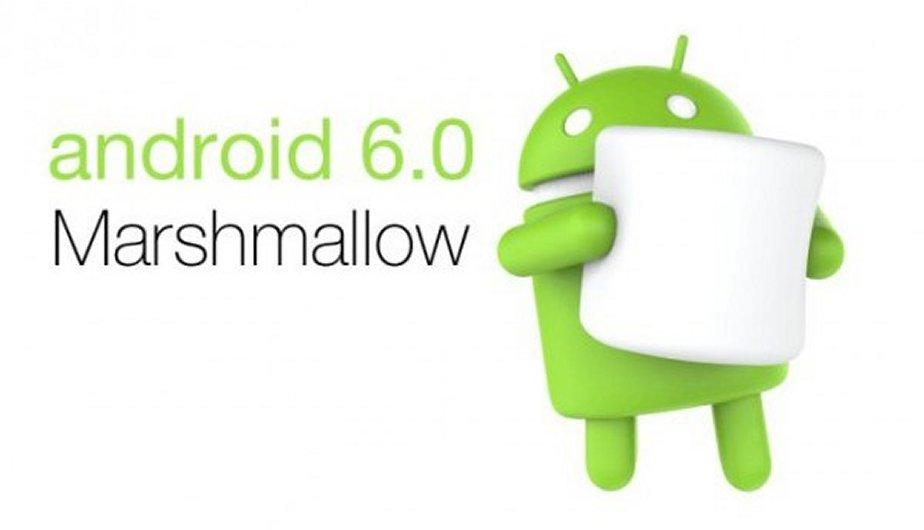

**Características**

**Now on Tap** permite invocar al assitente de google sin necesidad de salir de la aplicación en donde nos encontremos, basta con tocar y mantener apretado el botón de inicio.

Con Marshmallow defien que quieres compartir con tus aplicaciones y cuando lo quieres hacer.

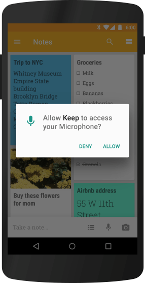

### Android 7.0 Nougat

**Características**

En esta versión se añaden las **vista multitarea** que permiten mantener aplicaciones en ejecución y en primer plano al mismo tiempo.

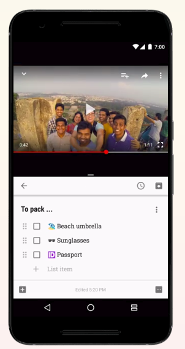

La **API de Vulkan** permite que los gráficos 3D de alto rendimiento cobren vida, son más nítidos y los efectos son más atractivos, y además Nougat ofrece un modulo integrado para realidad virtual llamado **RV**.

### Android 8.0 Oreo  

**Características**

Las notificaciones que no están visibles en Android Oreo ahora son representadas por un icono en la parte inferior del panel de notificaciones.

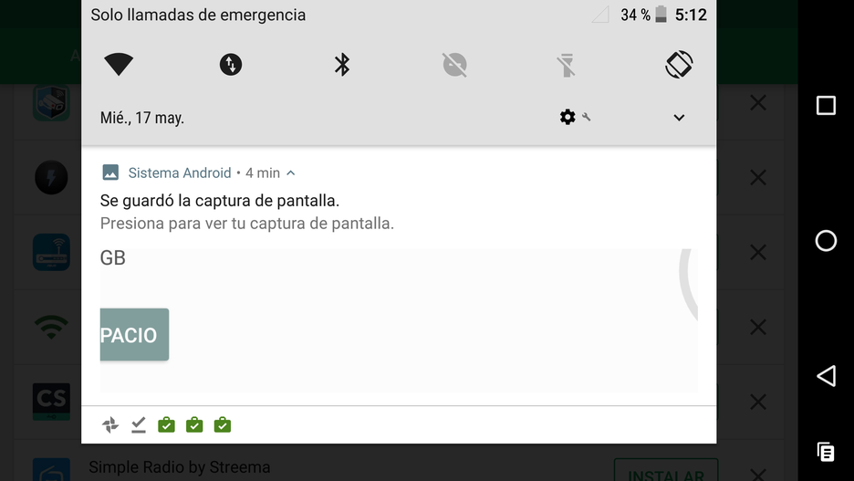

Además, existirá la posibilidad de desplegar las notificaciones de una aplicación en particular sin necesidad de acceder a ella.

Android O también trae otro montón de novedades, incluyendo la compatibilidad de multiventa Picture in Picture.

Se reinventan los emojis

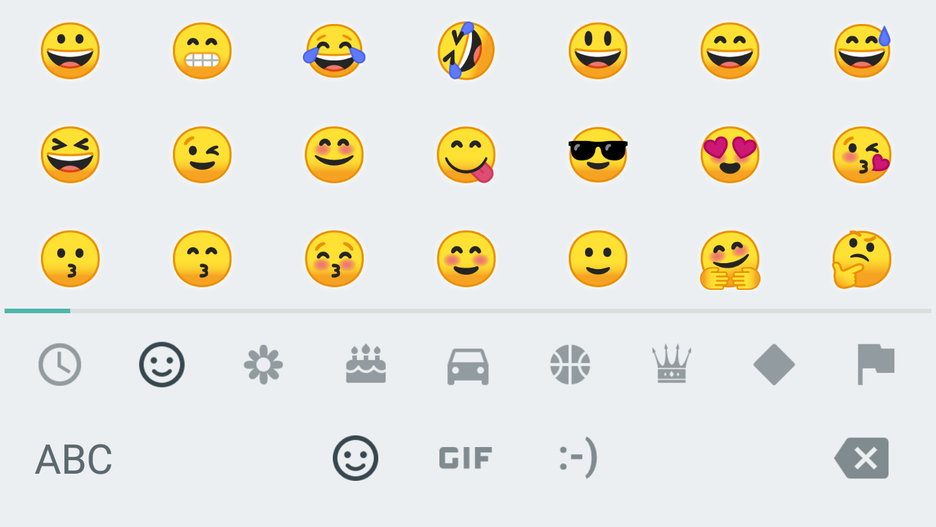

### Android 9.0 Pie

La nueva versión de Android incluye soporte para el protocolo Wi-Fi 802.11mc. También se conoce como Wi-Fi Round-Trip-Time (RTT) y permite al punto de acceso calcular tu distancia a él, conociendo tu posición dentro de un edificio.

Para ello requiere que el dispositivo se conecte a tres o más puntos de acceso que juntos triangularán tu posición. Con esta nueva función podremos ver implementaciones como Para ello requiere que el dispositivo se conecte a tres o más puntos de acceso que juntos triangularán tu posición. Con esta nueva función podremos ver implementaciones como **mapas exactos en interiores** de lugares públicos.

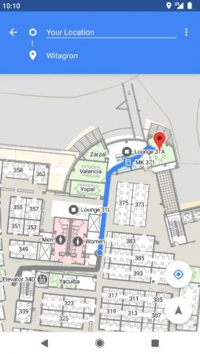

A partir de Android P los botones físicos de los móviles modificarán el volumen multimedia y si queremos cambiar el volumen de llamadas en algún momento deberemos entrar en el ajuste correspondiente.

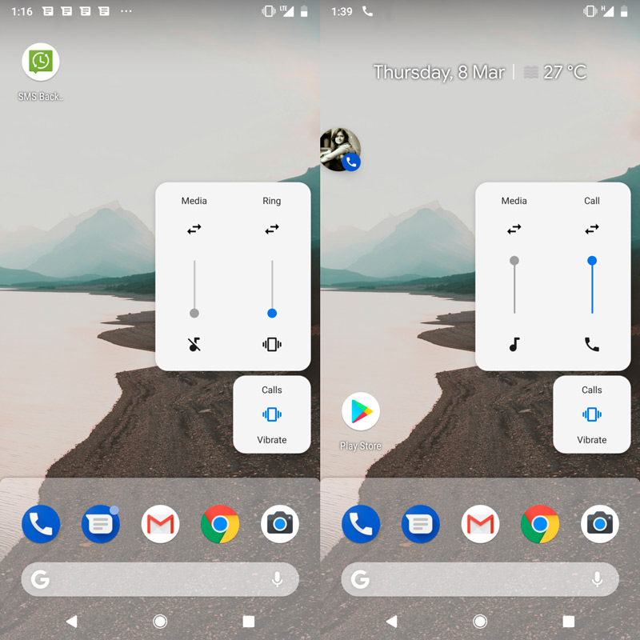

En **Oreo** podemos tener dos dispositivos bluetooth puestos a la vez, uno para llamadas y otro para sonido multimedia. En **Android P** podremos tener hasta 5, pero eso no significa que podamos emitir sonido a los 5, es solo para casos muy concretos. Además esta opción está en **los ajustes de desarrolladores**, lo que indica que no es para todos los usuarios.

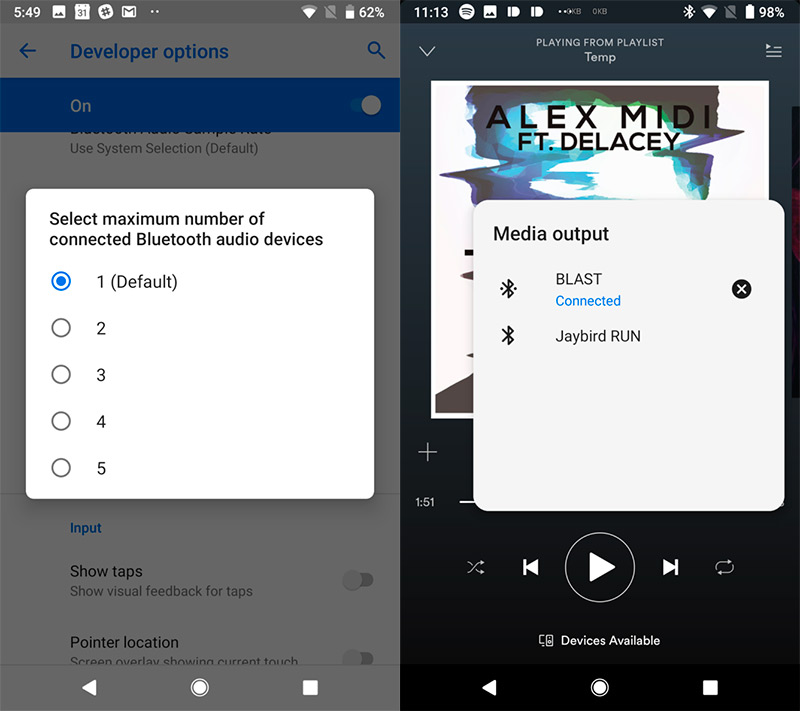

### Distribution Dashboard

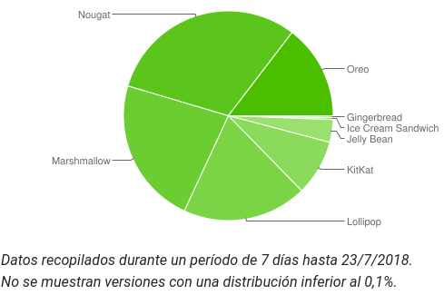

A continuación se muestran datos sobre la cantidad relativa de dispositivos que usan una versión determinada de la plataforma Android.

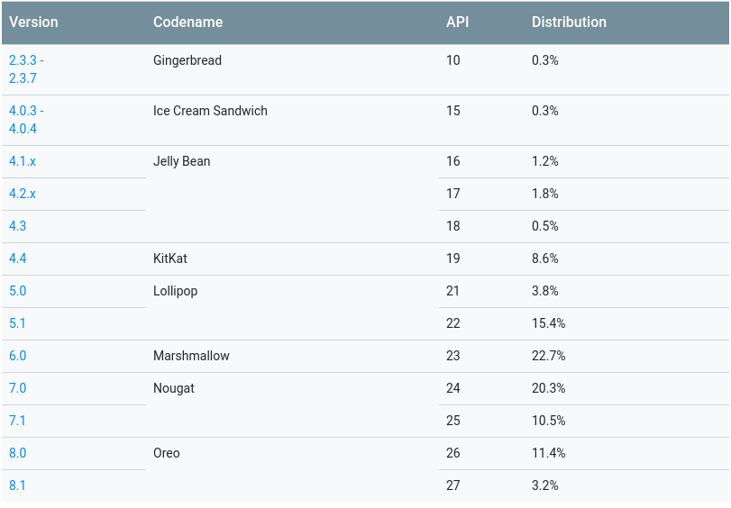

## Sistemas basados en Android (Forks)

### CyanogenMod

Comúnmente abreviado y conocido como CM, es un sistema operativo descontinuado de código abierto desarrollado por Cyanogen para teléfonos móviles y tabletas, basado principalmente en el popular sistema operativo Android.

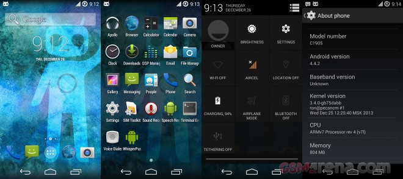

### LineageOS

LineageOS (también escrito Lineage OS) es un fork de Android de código abierto para teléfonos inteligentes y tabletas, siendo originariamente una herencia directa de CyanogenMod. De la misma forma que CM, se basa en los lanzamientos de Google para la plataforma de Android, incluyendo código adicional.

## Bibilografía

* https://www.android.com/history/#/marshmallow
* https://www.cnet.com/es/imagenes/novedades-android-o-siguiete-version-android-nougat/28/