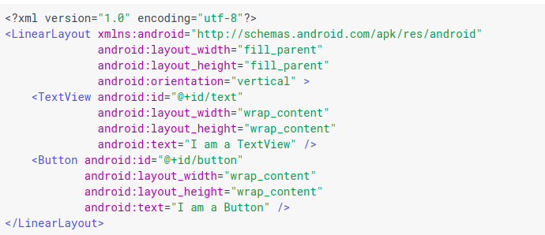
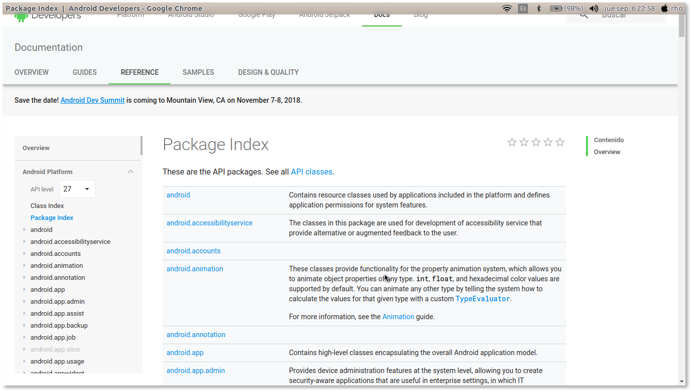
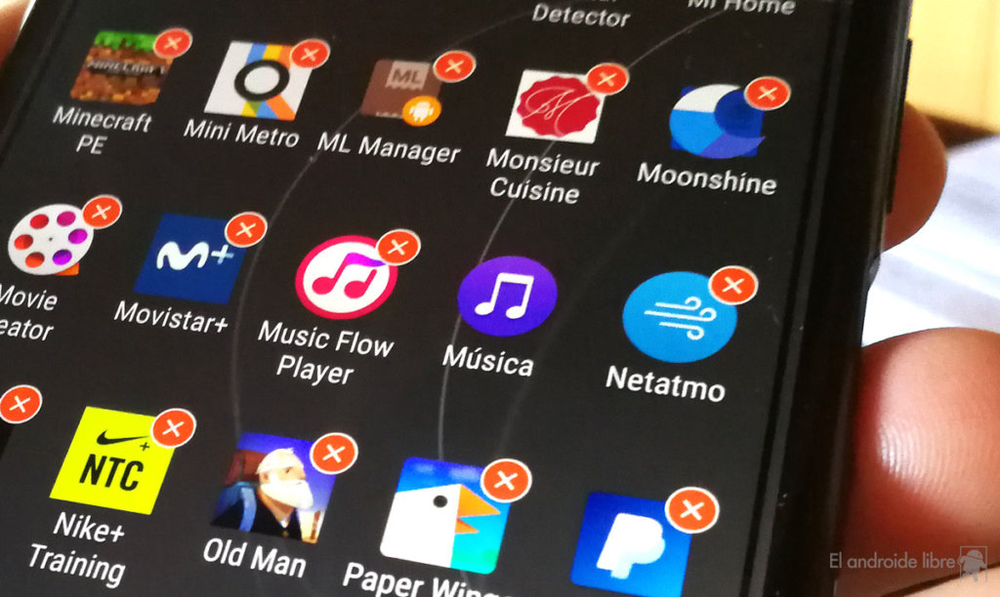

# Arquitectura de la plataforma

[TOC]

El sistema operativo se conforma de 6 capas principalmente, las cuales enunciamos a continuación.

## Kernel  de Linux

**Kernel** 

Es un módulo central de un sistema operativo, es la parte del sistema que carga primero y que se mantiene todo el tiempo en memoria principal. Comunmente el *kernel* es el encargado del manejo de memoria, el manejo de procesos y tareas y del manejro del disco. En resumen, el kernel conecta el hardware del sistema con el software de aplicación.

Cada sistema operativo posee un *kernel*, mucho sistemas operativos utilizan el kernel de Linux con es el caso de Android.

**Kernel de Linux**

El kernel de Linux 3.6 con aproximandamente 115 parches permite que Android aproveche funciones de seguridad claves y, al mismo tiempo, permite a los fabricantes de dispositivos desarrollar controladores de hardware para un kernel conocido. 

Además, proporciona un nivel de abstracción entre el dispositivo de hardware y contiene todos los controladores de hardware esenciales como la cámara, el teclado, la pantalla, etc.

## Capa de abstracción de hardware (HAL)

La capa de abstracción de hardware (HAL) brinda interfaces estándares que exponen las capacidades de hardware del dispositivo al framework de la Java API de nivel más alto. La HAL consiste en varios módulos de biblioteca y cada uno de estos implementa una interfaz para un tipo específico de componente de hardware, como el módulo de la cámara o de bluetooth. Cuando el framework de una API realiza una llamada para acceder a hardware del dispositivo, el sistema Android carga el módulo de biblioteca para el componente de hardware en cuestión.

**¿Por qué debe existir?**

Al crear un nivel de abstracción hace más fácil la conexión entre software y hardware.

Cuando se emplea una HAL, las aplicaciones **no acceden directamente al hardware** sino que lo hacen a la capa abstracta provista por la HAL. **Del mismo modo que las API, las HAL permiten que las aplicaciones sean independientes del hardware** porque abstraen información acerca de tales sistemas, como lo son las cachés, los buses de E/S y las interrupciones, y usan estos datos para darle al software una forma de interactuar con los requerimientos específicos del hardware sobre el que deba correr.

## Android Runtime (ART)

Android Runtime es un entorno de ejecución de aplicaciones utilizado por antroid.

Cada app ejecuta sus propios procesos con sus propias instancias del tiempo de ejecución de Android (ART). El ART está escrito para ejecutar varias máquinas virtuales en dispositivos de memoria baja ejecutando archivos DEX, un formato de código de bytes diseñado especialmente para Android y optimizado para ocupar un espacio de memoria mínimo.	

Estas son algunas de las funciones principales del ART:

- compilación ahead-of-time (AOT) y just-in-time (JIT);
- recolección de elementos no usados (GC) optimizada;
- mejor compatibilidad con la depuración, como un generador de perfiles de muestras dedicado, excepciones de diagnóstico detalladas e informes de fallos, y la capacidad de establecer puntos de control para controlar campos específicos.

Antes de Android 50 (nivel de API 21), Dalvik era el tiempo de ejecución del sistema operativo. **Si tu app se ejecuta bien en el ART, también debe funcionar en Dalvik**.

### JIT (Just-in-time)

Consiste en traducir el *bytecode*(Código un poco más abstracto que el código máquina) a código máquina nativo en tiempo de ejecución por ello generalmente se le conoce como **compilación dinámica**.

Básicamente, toma el código de una aplicación, lo analiza y lo convierte en algo que se ejecuta más rápido. Hace todo esto mientras la aplicación se está ejecutando, y de ahí viene la etiqueta "justo a tiempo".

### AOT

Ahead of time es un técnica de compilación que consiste en  crear un archivo de compilación posterior a la instalación de la aplicación. Este archivo es utilizado al abrir la aplicación, con esto se evita que la aplicación se compile continuamente, cada vez que ésta es ejecutada.

### Dalvik VM

Dalvik es la máquina virtual permite ejecutar aplicaciones programadas en Java. Utilizada originalmente por Android, y lleva a cabo la transformación de la aplicación en instrucciones de máquina, que luego son ejecutadas por el entorno de ejecución nativo del dispositivo.

El Dalvik VM está equipado con un compilador just-in-time basado en trazas para mejorar el rendimiento de ejecución de rutas o trazas ejecutadas frecuentemente.

## Bibliotecas C/C++ nativas

Muchos componentes y servicios centrales del sistema Android, como el ART y la HAL, se basan en código nativo que requiere bibliotecas nativas escritas en C y C++. La plataforma Android proporciona la API del framework de Java para exponer la funcionalidad de algunas de estas bibliotecas nativas a las apps. Por ejemplo, puedes acceder a OpenGL ES a través de la Java OpenGL API del framework de Android para agregar a tu app compatibilidad con los dibujos y la manipulación de gráficos 2D y 3D.

Si desarrollas una app que requiere C o C++, puedes usar el **NDK de Android** para acceder a algunas de estas bibliotecas de plataformas nativas directamente desde tu código nativo.

## Framework de la Java API

Todo el conjunto de funciones del SO Android está disponible mediante API escritas en el lenguaje Java. Estas API son los cimientos que necesitas para crear apps de Android simplificando la reutilización de componentes del sistema y servicios centrales y modulares, como los siguientes:

- Un [sistema de vista](https://developer.android.com/guide/topics/ui/overview.html?hl=es-419) enriquecido y extensible que puedes usar para compilar la IU de una app; se incluyen listas, cuadrículas, cuadros de texto, botones e incluso un navegador web integrable.

  

  

- Un [administrador de recursos](https://developer.android.com/guide/topics/resources/overview.html?hl=es-419) que te brinda acceso a recursos sin código, como strings localizadas, gráficos y archivos de diseño.

  

- Un [administrador de notificaciones](https://developer.android.com/guide/topics/ui/notifiers/notifications.html?hl=es-419) que permite que todas las apps muestren alertas personalizadas en la barra de estado.

  

- Un [administrador de actividad](https://developer.android.com/guide/components/activities.html?hl=es-419) que administra el ciclo de vida de las apps y proporciona una [pila de retroceso de navegación](https://developer.android.com/guide/components/tasks-and-back-stack.html?hl=es-419) común.

  

- [Proveedores de contenido](https://developer.android.com/guide/topics/providers/content-providers.html?hl=es-419) que permiten que las apps accedan a datos desde otras apps, como la app de Contactos, o compartan sus propios datos.

Los desarrolladores tienen acceso total a las mismas [API del framework](https://developer.android.com/reference/packages.html?hl=es-419) que usan las apps del sistema Android.

## Apps del sistema

En Android se incluye un conjunto de apps centrales para correo electrónico, mensajería SMS, calendarios, navegación en Internet y contactos, entre otros elementos. Las apps incluidas en la plataforma no tienen un estado especial entre las apps que el usuario elije instalar; por ello, **una app externa se puede convertir en el navegador web, el sistema de mensajería SMS o, incluso, el teclado predeterminado del usuario (existen algunas excepciones, como la app Settings del sistema).**

Las apps del sistema funcionan como apps para los usuarios y brindan capacidades claves a las cuales los desarrolladores pueden acceder desde sus propias apps. Por ejemplo, si en tu app se intenta entregar un mensaje SMS, no es necesario que compiles esa funcionalidad tú mismo; como alternativa, puedes invocar la app de SMS que ya está instalada para entregar un mensaje al receptor que especifiques.

## Bibliografia

* https://www.tutorialspoint.com/android/android_architecture.htm

* https://developer.android.com/guide/platform/?hl=es-419

* https://developer.android.com/ndk/samples/?hl=es-419

* https://source.android.com/setup/build/jack?hl=es-419

* https://www.androidcentral.com/android-z-what-jit