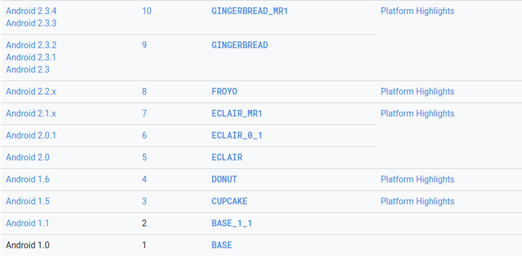
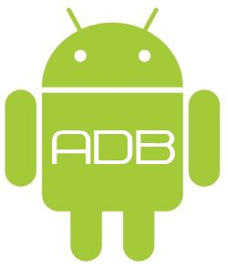
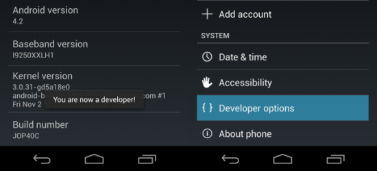
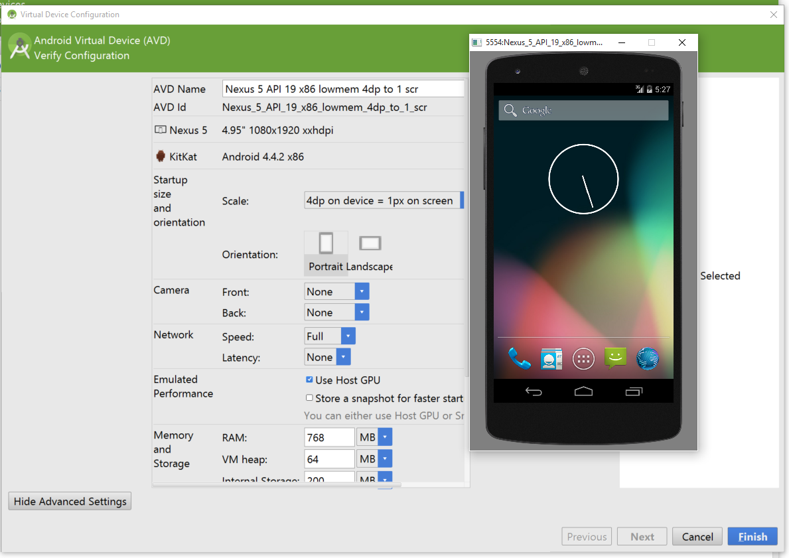
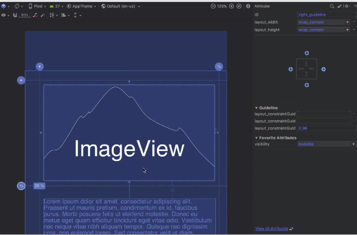
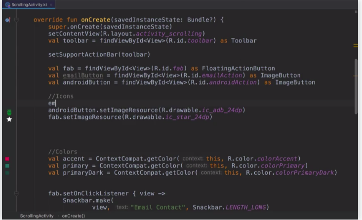
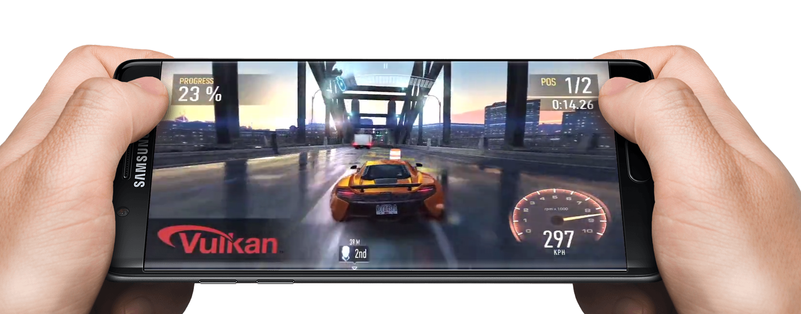

# Herramientas de desarrollo

## Android SDK

El Software development kit es un conjunto de herramientas de desarrollo de software que le permite al programador o desarrollador de software crear una aplicación.

Google ofrece de forma gratuita el SDK oficial, una serie de drivers, herramientas y recursos diversos para programar en Android, su sistema operativo móvil. 

### Nivel de API

#### ¿Qué es un nivel de API?

El nivel de API  es un valor entero que identifica de forma única la revisión de API de framework que ofrece una versión de la plataforma Android.

La plataforma Android proporciona un framework de API  que las aplicaciones pueden usar para interactuar con el sistema Android subyacente. La API de marco consiste en:

* Un conjunto básico de paquetes y clases
* Un conjunto de elementos y atributos XML para declarar un archivo de manifiesto
* Un conjunto de elementos y atributos XML para declarar y acceder a los recursos
* Un conjunto de *Intents*
* Un conjunto de permisos que las aplicaciones pueden solicitar, así como los permisos incluidos en el sistema.

Los actuales niveles de API son 

Antes de empezar a programar en Android hay que elegir la versión del sistema para la que deseamos realizar la aplicación. Es muy importante observar que hay clases y métodos que están disponibles a partir de una versión; si las vamos a usar, hemos de conocer la versión mínima necesaria.

## Android Debug Bridge (ADB)

Android Debug Bridge (ADB) es una herramienta de líneas de comandos versátil que te permite comunicarte con una instancia de un emulador o un dispositivo Android conectado. 

Esta herramienta proporciona diferentes acciones en dispositivos, como la instalación y la depuración de apps, y proporciona acceso a un shell Unix que puedes usar para ejecutar varios comandos en un emulador o un dispositivo conectado. Es un programa cliente-servidor que incluye tres componentes:

- **Un cliente**, que envía comandos. El cliente se ejecuta en tu máquina de desarrollo. Puedes invocar un cliente desde un terminal de línea de comandos emitiendo un comando de ADB.
- **Un daemon**, que ejecuta comandos en un dispositivo. El daemon se ejecuta como un proceso en segundo plano en cada instancia del emulador o dispositivo.
- **Un servidor**, que administra la comunicación entre el cliente y el daemon. El servidor se ejecuta como un proceso en segundo plano en tu máquina de desarrollo.

### Habilitar ADB en mi dispositivo

Para usar ADB con un dispositivo conectado a través de USB, debes habilitar **USB debugging** en la configuración del sistema del dispositivo, que se encuentra en **Developer options**.

En Android 4.2 y versiones posteriores, la pantalla Developer options se encuentra oculta de forma predeterminada. Para poder visualizarla, dirígete a **Settings > About phone** y presiona **Build number** siete veces. Cuando regreses a la pantalla anterior, verás **Developer options** en la parte inferior.

En algunos dispositivos, la pantalla Developer options puede encontrarse en otro lugar o tener un nombre diferente.

## Android Virtual Device (AVD)

Android Virtual Device (AVD) te permite definir las características de un teléfono Android, una tablet, o un dispositivo Android Wear o Android TV que desees simular en Android Emulator. El Administrador de AVD te permite crear y administrar AVD fácilmente.

**El perfil de hardware** define las características de un dispositivo cuando se envía desde la fábrica. El Administrador de AVD viene cargado previamente con determinados perfiles de hardware, como dispositivos de teléfono Nexus, y puedes definir e importar perfiles de hardware cuando sea necesario. Puedes sobrescribir algunas configuraciones en tu AVD, si es necesario.

**El Administrador de AVD** te permite elegir una imagen de sistema para tu AVD proporcionando recomendaciones: También te permite descargar imágenes de sistema, algunas con bibliotecas de complementos como las API de Google, que puede necesitar tu app. Ten en cuenta que las imágenes de sistema x86 se ejecutan de manera más rápida en el emulador.

El AVD tiene un área dedicada al almacenamiento en tu equipo de desarrollo. Almacena los datos del usuario del dispositivo, como las apps y las configuraciones instaladas, así como también una tarjeta SD emulada.

**Una máscara de emulador** especifica la apariencia de un dispositivo. El Administrador de AVD proporciona algunas máscaras predefinidas. También puedes definir tus propias máscaras o usar máscaras proporcionadas por terceros.

## Android Studio

Android Studio es el entorno de desarrollo integrado oficial para la plataforma Android. Reemplazó a Eclipse como el IDE oficial para el desarrollo de aplicaciones para Android. Está basado en el software IntelliJ IDEA de JetBrains y ha sido publicado de forma gratuita a través de la Licencia Apache 2.0.

### Requerimentos del sistema

#### Windows

- Microsoft® Windows® 7/8/10 (32- or 64-bit)
- 3 GB RAM minimum, 8 GB RAM recommended; plus 1 GB for the Android Emulator
- 2 GB of available disk space minimum,
  4 GB Recommended (500 MB for IDE + 1.5 GB for Android SDK and emulator system image)
- 1280 x 800 minimum screen resolution

#### Mac

- Mac® OS X® 10.10 (Yosemite) or higher, up to 10.13 (macOS High Sierra)
- 3 GB RAM minimum, 8 GB RAM recommended; plus 1 GB for the Android Emulator
- 2 GB of available disk space minimum,
  4 GB Recommended (500 MB for IDE + 1.5 GB for Android SDK and emulator system image)
- 1280 x 800 minimum screen resolution

#### Linux

* GNOME or KDE desktop

  *Tested on Ubuntu® 14.04 LTS, Trusty Tahr (64-bit distribution capable of running 32-bit applications)*

- 64-bit distribution capable of running 32-bit applications
- GNU C Library (glibc) 2.19 or later
- 3 GB RAM minimum, 8 GB RAM recommended; plus 1 GB for the Android Emulator

- 2 GB of available disk space minimum,
  4 GB Recommended (500 MB for IDE + 1.5 GB for Android SDK and emulator system image)
- 1280 x 800 minimum screen resolution

### Características

#### Editor de diseño visual

Cree diseños complejos  y obtenga una vista previa de su diseño en cualquier tamaño de pantalla seleccionando una de las diversas configuraciones de dispositivos o simplemente cambiando el tamaño de la ventana de vista previa.

#### Analizador APK

Encuentre oportunidades para reducir el tamaño de su aplicación de Android inspeccionando el contenido del archivo APK de su aplicación, incluso si no fue creado con Android Studio. 

#### Editor de código inteligente

Escriba mejor código, trabaje más rápido y sea más productivo con un editor de código inteligente que proporciona la finalización de código para Kotlin, Java y C / C ++.

## Otras herramientas

### Android NDK

Android NDK es un conjunto de herramientas que le permite implementar partes de su aplicación en código nativo, usando lenguajes como C y C ++. Para ciertos tipos de aplicaciones, esto puede ayudarlo a reutilizar las bibliotecas de códigos escritas en esos idiomas.

### Vulkan Graphics API

Esta es una API multiplataforma de baja sobrecarga para gráficos 3D de alto rendimiento. Proporciona herramientas para crear gráficos de alta calidad en tiempo real en las aplicaciones. 

## Bibliografía

* https://developer.android.com/studio/command-line/adb?hl=es-419

* http://www.androidcurso.com/index.php/recursos/31-unidad-1-vision-general-y-entorno-de-desarrollo/146-las-versiones-de-android-y-niveles-de-api

* https://developer.android.com/guide/topics/manifest/uses-sdk-element#ApiLevels