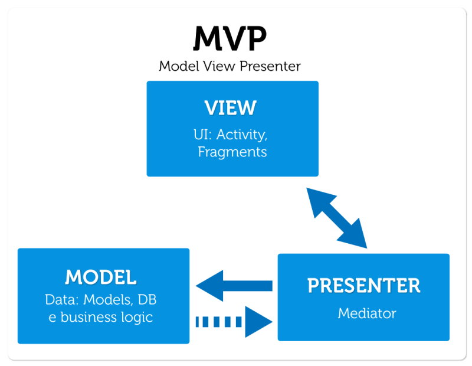

# MVC 

[TOC]

## Patrones de arquitectura de software

Describen soluciones al nivel más alto de software y hardware. Normalmente soportan requerimientos no funcionales .

Un ejemplo de patrón de arquitectura es el *modelo cliente servidor*.

## Patrones de diseño de software

Los patrones de diseño son el esqueleto de las soluciones a problemas comunes en el desarrollo de software.

Debemos tener presente los siguientes elementos de un patrón: su nombre, el problema (cuando aplicar un patrón), la solución (descripción abstracta del problema) y las consecuencias (costos y beneficios).

### Clasificación de patrones de diseño

Existen varios patrones de diseño popularmente conocidos, los cuales se clasifican como se muestra a continuación:

#### Patrones Creacionales 

Inicialización y configuración de objetos.

**Singleton**: limita a uno el número de instancias posibles de una clase en nuestro programa, y proporciona un acceso global al mismo.

**Builder**: Separa la creación de un objeto complejo de su estructura, de tal forma que el mismo proceso de construcción nos puede servir para crear representaciones diferentes.

**Factory Method:** Expone un método de creación,  delegando en las subclases la implementación de este método.

#### Patrones Estructurales

Separan la interfaz de la implementación. Se ocupan de cómo las clases y objetos se agrupan, para formar estructuras más grandes.

**Adapter**: Permite a dos clases con diferentes interfaces trabajar entre ellas, a través de un objeto intermedio con el que se comunican e interactúan.

**Bridge**: Desacopla una abstracción de su implementación, para que las dos puedan evolucionar de forma independiente. 

#### Patrones de Comportamiento

Más que describir objetos o clases, describen la comunicación entre ellos.

**Command**: Son objetos que encapsulan una acción y los parámetros que necesitan para ejecutarse.
**Chain of responsibility**: se evita acoplar al emisor y receptor de una petición dando la posibilidad a varios receptores de consumirlo. Cada receptor tiene la opción de consumir esa petición o pasárselo al siguiente dentro de la cadena.

## Patrones de Programación  (Idioms)

* Describen soluciones en el nivel de software más bajo (clases y métodos).
* Generalmente soportan características específicas de un lenguaje de programación.

## MVC

Es un patrón de arquitectura de las aplicaciones software. De manera genérica, los componentes de MVC se podrían definir como sigue:

* **El Modelo**: Es la representación de la información con la cual el sistema opera, por lo tanto gestiona todos los accesos a dicha información, tanto consultas como actualizaciones, implementando también los privilegios de acceso que se hayan descrito en las especificaciones de la aplicación (lógica de negocio). 

  Envía a la 'vista' aquella parte de la información que en cada momento se le solicita para que sea mostrada (típicamente a un usuario). Las peticiones de acceso o manipulación de información llegan al 'modelo' a través del 'controlador'.

  

* **El Controlador**: Responde a eventos (usualmente acciones del usuario) e invoca peticiones al 'modelo' cuando se hace alguna solicitud sobre la información (por ejemplo, editar un documento o un registro en una base de datos). 

  También puede enviar comandos a su 'vista' asociada si se solicita un cambio en la forma en que se presenta el 'modelo' (por ejemplo, desplazamiento o scroll por un documento o por los diferentes registros de una base de datos), por tanto se podría decir que el 'controlador' hace de intermediario entre la 'vista' y el 'modelo' (véase Middleware).

  

* **La Vista**: Presenta el 'modelo' (información y lógica de negocio) en un formato adecuado para interactuar (usualmente la interfaz de usuario), por tanto requiere de dicho 'modelo' la información que debe representar como salida.

  

La siguiente imagen es una representación del modelo vista controlador.

## MVP

Modelo–Vista–Presentador (MVP) es una derivación del patrón arquitectónico modelo–vista–controlador (MVC), y es utilizado mayoritariamente para construir interfaces de usuario.

En MVP el presentador asume la funcionalidad del "intermediario". En MVP, toda lógica de presentación es colocada al presentador.

MVP es un patrón arquitectónico de interfaz de usuario diseñada para facilitar pruebas de unidad automatizada y mejorar la separación de inquietudes en lógica de presentación:

* **El modelo** es una interfaz que define los datos que se mostrará o no actuado en la interfaz de usuario.

* **El presentador** actúa sobre el modelo y la vista. Recupera datos de los repositorios (el modelo), y los formatea para mostrarlos en la vista.

* **La vista** es una interfaz pasiva que exhibe datos (el modelo) y órdenes de usuario de las rutas (eventos) al presentador para actuar sobre los datos.

## Diferencias entre MVC y MVP

El MVP se basa en el MVC. Como comparten varios conceptos, puede ser difícil diferenciarlos. El presentador y el controlador tienen un rol similar. Ellos son responsables de la comunicación entre el Modelo y la Vista, pero el controlador no administra el modelo ni la vista tan estrictamente como lo hace el presentador.

En el patrón MVC, la capa de Vista es algo inteligente y puede recuperar datos directamente del Modelo. En el patrón de MVP, la vista es completamente pasiva y el presentador siempre entrega datos a la vista. Los controladores en MVC también se pueden compartir entre múltiples Vistas. En MVP, la Vista y el Presentador tienen una relación de uno a uno, por lo tanto, el Presentador está vinculado a una Vista.

## MVVM

El patron Model - View - ViewModel fue concebido por John Gossman allá por el año 2005 en un post de su blob titulado "Introduction to Model/View/ViewModel pattern for building WPF apps". 

Este patrón junto a otros mas conocidos como MVC o MVP tiene por objetivo simplificar las tareas de desarrollo y mantenimiento del software escrito con estos a través de la división de ocupaciones. 	

* **El modelo**. Representa la capa de datos y/o la lógica de negocio, también denominado como el objeto del dominio. El modelo contiene la información, pero nunca las acciones o servicios que la manipulan. En ningún caso tiene dependencia alguna con la vista.

* **La vista**. La misión de la vista es representar la información a través de los elementos visuales que la componen. Las vistas en MVVM son activas, contienen comportamientos, eventos y enlaces a datos que, en cierta manera, necesitan tener conocimiento del modelo subyacente.

* **Modelo de vista**. El modelo de vista es un actor intermediario entre el modelo y la vista, contiene toda la lógica de presentación y se comporta como una abstracción de la interfaz. La comunicación entre la vista y el viewmodel se realiza por medio los enlaces de datos.

### Comparación entre MVC y MVVM

| Características                        | MVC                           | MVVM                                   |
| -------------------------------------- | ----------------------------- | -------------------------------------- |
| Acoplamiento con la vista              | My poco con la plantilla      | Muy poco                               |
| Acoplamiento con el componente         | Un poco                       | Muy poco                               |
| Codificar en la vista                  | Mediante el ID del componente | A través de una expresión Data binding |
| Implementación de un controlador       | Extendemos ZK's composer      | Es un POJO                             |
| Actualización de la interfaz e usuario | Manipulación directamente     | Automático (@NotifyChange)             |
| Nivel de control del componente        | Elevado, control total        | Noraml                                 |
| Rendimiento                            | Alto                          | Normal                                 |

## Bibliografía

* https://android.jlelse.eu/why-to-choose-mvvm-over-mvp-android-architecture-33c0f2de5516

* https://code.tutsplus.com/tutorials/an-introduction-to-model-view-presenter-on-android--cms-26162

* https://code.tutsplus.com/es/tutorials/how-to-adopt-model-view-presenter-on-android--cms-26206

* https://developer.android.com/topic/libraries/architecture/

* https://developer.android.com/jetpack/

* https://developer.android.com/topic/libraries/architecture/viewmodel

* https://devexperto.com/patrones-de-diseno-software/

* https://code.tutsplus.com/es/tutorials/how-to-adopt-model-view-presenter-on-android--cms-26206

* https://code.tutsplus.com/tutorials/an-introduction-to-model-view-presenter-on-android--cms-26162

* https://developer.android.com/guide/components/loaders

* https://developer.android.com/guide/topics/providers/content-providers

* https://www.adictosaltrabajo.com/tutoriales/zk-mvc-mvvm/