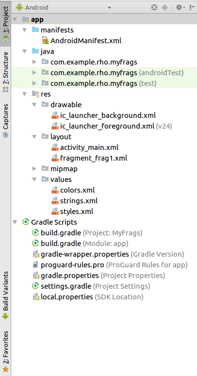
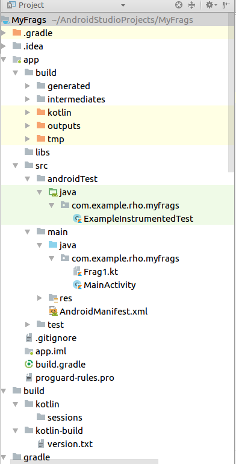
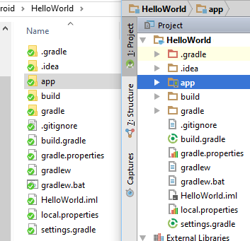

# Estructura de una aplicación

[TOC]

Por cada aplicación de Android es necesario generar un proyecto y al generar un proyecto se creará la jerarquía de directorios presentadas a continuación. 

**NOTA : La siguiente jerarquía de directorios es para la versión 3.2 del IDE y realizando un proyecto con Kotlin.** 

También es importante notar que tenemos dos vistas posibles para nuestro proyecto.

* Vista "Android"
* Vista "Project"

En la vista project nos entrega más información.

Si realiza un proyecto con *Java* la estructura será muy similar y puede verse en la siguiente imagen

Si el lector busca en tutoriales u otros archivos que ayuden a su estudio se dará cuenta que anteriormente se manejaba la siguiente estructura.

En este curso se trabajará con **Kotlin** y la versión 3.2 de **Android studio**, dicha estructura corresponde a la imagen del inicio. A continuación se analizará a fondo que contiene cada directorio y para que nos sirve cada archivo.

## Archivos y directorios importantes

### Directorio app

En el directorio app se guardan todos los archivos y directorios necesarios para el correcto funcionamiento de nuestra aplicación.

### Archivo AndroidManifest.xml

El archivo AndroidManifest.xml se utiliza para configurar la aplicación y le da a la aplicación final construida importantes propiedades. Estas propiedades aparecen en el paquete compilado de aplicaciones de Android (APK) y son utilizadas por las tiendas de aplicaciones, por ejemplo. Google Play y el sistema operativo Android (OS) para comprender los requisitos y las capacidades de la aplicación.

Algunos ejemplos de configuración o permisos son:

* Permiso para poder utilizar la cámara del dispositivo donde se instala la aplicación.

### Directorio java

Contiene los archivos de Java o de Kotlin que le darán funcionalidad a nuestra aplicación. Además, existen directorios en donde podemos hacer pruebas.

* **androidTest** es para pruebas unitarias que involucran instrumentación de Android.

  Pruebas unitarias que se ejecutan en un dispositivo Android o emulador. Estas pruebas tienen acceso a la información de la instrumentación, como el contexto de la aplicación que está probando. Use estas pruebas cuando sus pruebas tengan dependencias de Android que los objetos simulados no puedan satisfacer.

* **test** es para prueba de unidad pura que no involucra a Android Framework. Puede ejecutar pruebas aquí sin ejecutar en un dispositivo real o en el emulador.

  Pruebas unitarias que se ejecutan localmente en la Máquina Virtual Java (JVM). Utilice estas pruebas para minimizar el tiempo de ejecución cuando sus pruebas no tienen dependencias del marco de Android o cuando puede burlarse de las dependencias del marco de Android.

### Directorio res y sus subdirectorios

El directorio *res* contiene todos los diversos tipos de recursos utilizados por una aplicación.

#### Subdirectorio drawable

Imágenes y elementos de pantalla (se pueden admitir diferentes tamaños de pantalla, por ejemplo drawable-hdpi).

#### Subdirectorio layout

Guardar definiciones de pantalla y fragmentos (para layouts horizontales y verticales).

#### Subdirectorio mipmap

Launcher icons to support different screen densities.

#### Subdirectorio values

Definición de cadenas y constantes, por ejemplo la definición de los colores.

**¿Para qué se utiliza?**

Es lo ideal para traducir la aplicación.

### La clase R

El archivo R.java es una archivo que se autogenera dentro de la carpeta build, para linkear todos los recursos que tenemos en nuestro proyecto al código Java.

### Archivo .dex

Los programas de Android se compilan en archivos .dex (Dalvik Executable), que a su vez están comprimidos en un solo archivo .apk en el dispositivo. Los archivos .dex se pueden crear traduciendo automáticamente las aplicaciones compiladas escritas en el lenguaje de programación Java o para nuestro caso, en Kotlin.

### Archivo .apk

Un Android Package Kit (APK para abreviar) es el formato de archivo del paquete utilizado por el sistema operativo Android para la distribución e instalación de aplicaciones móviles.

**Caso Pokemon Go**

## Bibliografía

* https://developer.android.com/guide/topics/manifest/manifest-intro

* https://developer.android.com/studio/projects/

* http://www.tuprogramacion.com/programacion/estructura-de-una-aplicacion-android/

* http://www.hermosaprogramacion.com/2014/08/android-studio-proyecto-en/