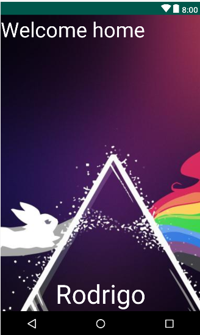

# FrameLayout

## Joshi


*joshi.xml*

```xml
<FrameLayout xmlns:android="http://schemas.android.com/apk/res/android"
    xmlns:tools="http://schemas.android.com/tools"
    android:layout_width="match_parent"
    android:layout_height="match_parent"
    tools:context=".MainActivity">

    <Button
        android:layout_width="match_parent"
        android:layout_height="60dp"
        android:text="Saltar"
        android:id="@+id/boton_saltar"
        android:layout_gravity="center_horizontal|bottom"/>

    <ImageView
        android:layout_width="match_parent"
        android:layout_height="match_parent"
        android:id="@+id/imagen_background"
        android:layout_gravity="top|center"
        android:src="@drawable/oneigm"
        android:scaleType="centerCrop" />

    <ImageView
        android:layout_width="wrap_content"
        android:layout_height="wrap_content"
        android:id="@+id/imagen_estadistica"
        android:layout_gravity="center"
        android:src="@drawable/download"
        android:padding="16dp" />

</FrameLayout>
```

*styles.xml*

```xml
<resources>
    <!-- Base application theme. -->
    <style name="AppTheme" parent="Theme.AppCompat.Light.NoActionBar">
        <!-- Customize your theme here. -->
        <item name="colorPrimary">@color/colorPrimary</item>
        <item name="colorPrimaryDark">@color/colorPrimaryDark</item>
        <item name="colorAccent">@color/colorAccent</item>
    </style>
</resources>   
```


## PinkFloyd background



*pinkfloyd.xml*

```xml
<?xml version="1.0" encoding="utf-8"?>
<FrameLayout xmlns:android="http://schemas.android.com/apk/res/android"
             android:layout_width="match_parent"
             android:layout_height="match_parent">
    <ImageView
            android:id="@+id/ImageView01"
            android:layout_height="fill_parent"
            android:layout_width="fill_parent"
            android:src="@drawable/pinkfloyd"
            android:scaleType="matrix"></ImageView>
    <TextView
            android:layout_width="fill_parent"
            android:layout_height="wrap_content"
            android:textColor="#fff"
            android:textSize="40dp"
            android:text="Welcome home" />
    <TextView
            android:layout_width="fill_parent"
            android:layout_height="wrap_content"
            android:text="Rodrigo"
            android:layout_gravity="bottom"
            android:gravity="right"
            android:textColor="#fff"
            android:textSize="50dp"/>

</FrameLayout>
```

*styles.xml*

```xml
<resources>
    <!-- Base application theme. -->
    <style name="AppTheme" parent="Theme.AppCompat.Light.NoActionBar">
        <!-- Customize your theme here. -->
        <item name="colorPrimary">@color/colorPrimary</item>
        <item name="colorPrimaryDark">@color/colorPrimaryDark</item>
        <item name="colorAccent">@color/colorAccent</item>
    </style>
</resources>   
```

## PinkFloyd dinámico

mainActivity.kt

```kotlin
class MainActivity : AppCompatActivity() {

    override fun onCreate(savedInstanceState: Bundle?) {
        super.onCreate(savedInstanceState)
        setContentView(createFrameL())
    }

    private fun createFrameL() : FrameLayout {
        val tv1 = TextView(this)
        tv1.text = "hello"
        tv1.textSize = 40f
        tv1.setTextColor(Color.BLACK)

        val tv2 = TextView(this)
        tv2.layoutParams = ActionBar.LayoutParams(
            ActionBar.LayoutParams.FILL_PARENT,
            ActionBar.LayoutParams.WRAP_CONTENT,
            Gravity.BOTTOM
        )
        tv2.textSize = 50f
        tv2.gravity = Gravity.RIGHT
        tv2.text = "bye"
        tv2.setTextColor(Color.WHITE)

        val iv1 = ImageView(this)
        iv1.setImageResource(R.drawable.pinkfloyd)
        iv1.layoutParams =
                ActionBar.LayoutParams(ActionBar.LayoutParams.FILL_PARENT, ActionBar.LayoutParams.FILL_PARENT)
        iv1.scaleType = ImageView.ScaleType.MATRIX

        val fl = FrameLayout(this)
        fl.layoutParams = ActionBar.LayoutParams(ActionBar.LayoutParams.FILL_PARENT, ActionBar.LayoutParams.FILL_PARENT)
        fl.addView(iv1)
        fl.addView(tv1)
        fl.addView(tv2)
        return fl
    }
}
```

