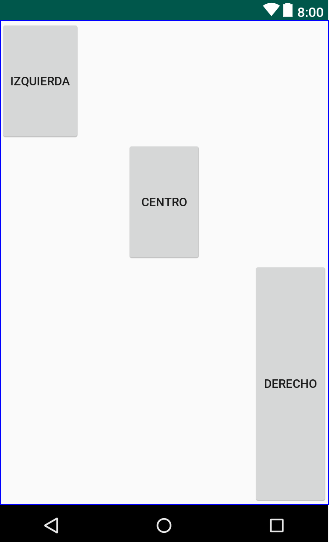

# Linearlayout

## Gravity in linear



*gravlinear.xml*

```xml
<?xml version="1.0" encoding="utf-8"?>
<LinearLayout xmlns:android="http://schemas.android.com/apk/res/android"
              android:orientation="vertical"
              android:weightSum="4"
              android:layout_width="match_parent"
              android:layout_height="match_parent">
    <Button
            android:layout_weight="1"
            android:layout_gravity="left|top"
            android:layout_width="wrap_content"
            android:layout_height="0dp"
            android:text="izquierda"/>
    <Button
            android:layout_weight="1"
            android:layout_gravity="center"
            android:layout_width="wrap_content"
            android:layout_height="0dp"
            android:text="centro"/>
    <Button
            android:layout_weight="2"
            android:layout_gravity="right|bottom"
            android:layout_width="wrap_content"
            android:layout_height="0dp"
            android:text="derecho"/>
</LinearLayout>
```

