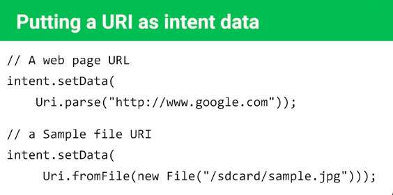
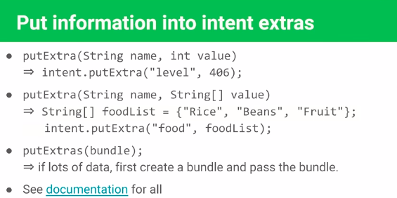

# Intents

[TOC]

Un intent es una descripción abstracta de una operación a realizar. En otras palabras, es un objeto de mensajería que puede ser usada para solicitar una acción de otro componete de la aplicación.

**Los intent puden ser usados para** :

1. Iniciar otra actividad
2. Iniciar un servicio
3. Entregar un broadcast (mensaje)

**Iniciar una nueva actividad**

La función más común de los *intents* es la de empezar una nueva actividad. Es posible iniciar una nueva instancia de una actividad pasando un *intent* al método `startActivity()` .

El intent le dice a la acitividad que debe iniciar y además de ello le *proporciona la información necesaria.*

**Iniciar un servicio**

Se hace los mismo que para activity, el Intent describe que el serivicio debe iniciar y cargar la información necesaria para ser transferida al método `startService()`.

**IMPORTANTE**

> Es importante revisar la versión de API con la que se este trabajando ya que a partir de Android 5.0, para iniciar un servicio se usan los métodos de la clase JobScheduler en lugar de startService()

**Transmitir un broadcast**

Puede transmitir un broadcast (mensaje) a otras aplicaciones pasando un Intent con los siguientes métodos, `sendBroadcast ()` o `sendOrderedBroadcast ()`.

Existen dos tipos de *intents*, que son em explícito y el implícito, a continuación se aclara a que se refiere cada uno y cuando es que debemos de utilizarlos.

## Intent explícito

Un intent explícito sucede cuando el programador específica la aplicación que va a satisface el *intent*, esto sucede comunmente cuando se quiere iniciar un componente de nuestra aplicación.

[](https://github.com/Angel5215/Moviles/blob/master/Android/Intents/img/intent-explicito.jpg)

```kotlin
val intent = Intent(this, SecondActivity::class.java)
val message = editText_main!!.text.toString()

intent.putExtra(EXTRA_MESSAGE, message)
startActivityForResult(intent, TEXT_REQUEST)
```

## Intent implícito

Un *intent* sucede cuando no se específica el nombre del componente a iniciar, pero en lugar de ello se declara la acción general a ser ejecutada.

Por ejemplo. Cuando queremos mostrar la ubicación del usuario se usa un intent implícito para solicitar que otra aplicación capaz de mostrar mapas sea abierta.

[](https://github.com/Angel5215/Moviles/blob/master/Android/Intents/img/intent-implicitos.png)

```kotlin
Intent intent= new Intent(action, uri);

// Mostrar una página web
Uri uri = Uri.parse("https://www.google.com");
Intent it = new Intent (Intent.ACTION_VIEW,uri);
startActivity(it);

// Mostrar una página web en Kotlin
fun openGoogle(){
    val it = Intent(Intent.ACTION_VIEW,Uri.parse("http://www.google.com"))
    startActivity(it)
}

// Marcar un numero telefonico
Uri uri = Uri.parse("tel:5519390782");
Intent it = new Intent(Intent.ACTION_DIAL, uri);
startActivity(it);
```

### Native android actions

Las acciones nativas de android son todas aquellas acciones que el usuario puede realizar con su smartphone, de esta manera, la acción de marcar un número se traduce como `ACTION_DIAL`, como el lector imaginará, estás  acciones se utilizan en los *intent implícitos*.

Algunos ejemplos de **native android actions** son

| Action            | Descripción                                                  |
| ----------------- | ------------------------------------------------------------ |
| ACTION-ANSWER     | Opens an Activity that handles immediately initiates a call using the number supplied in the Intent URI. Genereally it's considered better from to use ACTION_DIAL if possible. |
| ACTION_DELETE     | Starts an Activity hat lets you delete the data specified at that Intent's data URI. |
| ACTION_DIAL       | Brings up a dialer application with the number to dial pre-populated from the Intent URI. By default this is handled by the native Android phone dialer. |
| ACTION_EDIT       | Requests an Activity that can edit that data at the specified Intent URI. ACTION_INSERT |
| ACTION_PICK       |                                                              |
| ACTION_SEARCH     |                                                              |
| ACTION_SENDTO     |                                                              |
| ACTION_SEND       |                                                              |
| ACTION_VIEW       |                                                              |
| ACTION_WEB_SEARCH |                                                              |

## Transferencia de datos

### El objeto URI



### El objeto Bundle



### Recibiendo datos


#### Recibiendo datos a través de bundle

```kotlin
val bundle = intent.extras 
// intent es el nombre de la variable que se creo para pasar el Intent
val name = bundle.get("name")
tvGreeting.text = getString(R.string.welcome, name)
```

### Regresando datos a la actividad inicial


Para regresar datos a la actividad inicial, establezcamos cierta notación 

Sea `act1` la primer actividad y `act2` la segunda actividad. 

1. En primera instancia `act1` le envía datos a `act2`.

2. Luego `act2` procesa estos datos y le regresa la información a `act1`.

3. Por útlimo, `act1` recupera la información enviada por `act2.`

**Importante**

> Sabemos que para iniciar otra actividad debemos utilizar el método `startActivity()` pero, si queremos una respuesta de `act2` debemos utilizar el siguiente método `startActivityForResult()`

Veamos ahora como regresar la información mediante el siguiente snipet.

```kotlin
fun performedOpt(result: Int) {
    var returnIntent = Intent()
    returnIntent.putExtra("result", result) 
    //result es la info que se le enviará a act1
    setResult(Activity.RESULT_OK, returnIntent)
    finish() //finaliza la actividad en la que estamos
}
```

Por último, la siguiente porción de código es válida para recuperar la información de `act2`

```kotlin
override fun onActivityResult(requestCode: Int, resultCode: Int, data: Intent?) {
    super.onActivityResult(requestCode, resultCode, data)
    if (resultCode == RESULT_OK)
    if (data != null) {
        tvResult.text = data.extras.get("result").toString()
    }
}
```

Observe que ha que sobre-escribir el método onActivityResult y obtener la información necesaria de `act2`.

## Referencias y/o bibliografía 

http://hmkcode.com/android-startactivityforresult/