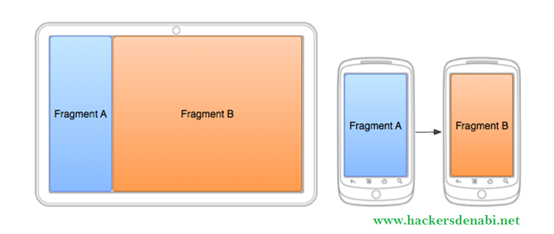
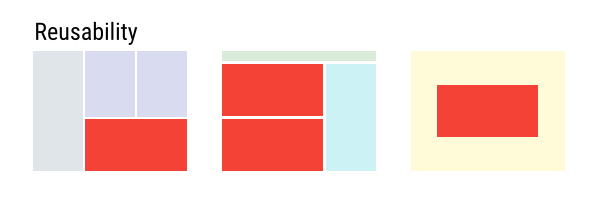

# Fragments

[TOC]

Un Fragment representa un comportamiento generalmente en segundo plano o una parte de la interfaz de usuario en una Activity. Puedes combinar múltiples fragmentos en una sola actividad para crear una IU multipanel. 

Se puede pensar en un fragmento como una sección modular de una actividad que tiene su ciclo de vida propio, recibe sus propios eventos de entrada y que puedes agregar o quitar mientras la actividad se esté ejecutando (algo así como una "subactividad" que puedes volver a usar en diferentes actividades). *[Tomado directamente de developer.android.com]*

## ¿Por qué existen?

Android introduce los fragmentos en Android 3.0 (nivel de API 11), principalmente para admitir diseños de IU más dinámicos y flexibles en pantallas grandes, como las de las tablets. 

Como la pantalla de una tablet es mucho más grande que la de un teléfono, hay más espacio para combinar e intercambiar componentes de la IU. 

Los fragmentos admiten esos diseños sin la necesidad de que administres cambios complejos en la jerarquía de vistas. Al dividir el diseño de una actividad en fragmentos *[Tomado directamente de developer.android.com]*.

Debido a que los fragmentos aparecerion en la versión 3, para las versiones anteriores Google proporcionó esta característica como parte de la libreria de compatibilidad *support-v4*. Si nuestro proyecto incluye la librería de soporte appcompat-v7 (inlcuida por defecto en los proyectos de Android Studio, ver fichero build.gradle) no debemos preocuparnos por más, ya que support-v4 es una dependencia de ésta y por tanto también estará incluida.

### Modularidad

División de código de actividad complejo en fragmentos para una mejor organización y mantenimiento.

### Reusabilidad 

Colocar las partes de la interfaz de usuario o el comportamiento en fragmentos que pueden compartirse en múltiples actividades.

### Adaptibilidad

Representar secciones de una interfaz de usuario como diferentes fragmentos y utilizar diferentes diseños según la orientación y el tamaño de la pantalla.

## Ciclo de vida de una actividad

**Los fragmentos siempre son llamados por una actividad, por lo tanto si la actividad muere, el fragmento muere con ella.**

Un fragmento es muy similar a una actividad excepto por algunas cuantas funciones más que corresponden a como un fragmento se unen a las actividades.

## Agregar fragmentos

### Agregar fragmentos con UI

### Agregar fragmentos sin UI

## Admninistrar fragmentos

## Referencias y/o bibliografía

https://www.raywenderlich.com/361-android-fragments-tutorial-an-introduction-with-kotlin

http://www.sgoliver.net/blog/fragments-en-android/

https://developer.android.com/guide/components/fragments?hl=es-419#Adding