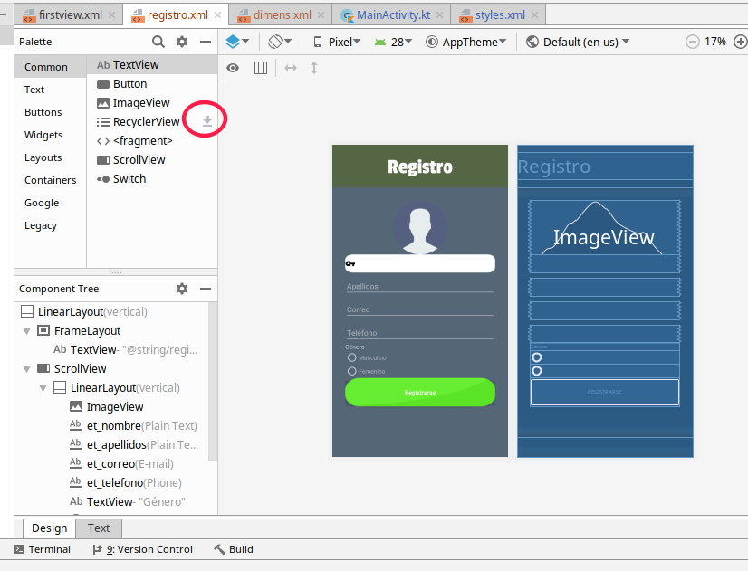
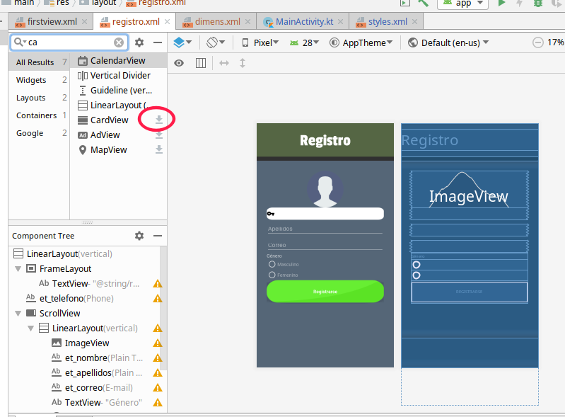

# Avisos

## Avisos para el 11 de Junio de 2019

* Instalar Android Studio
* Instalar un emulador de télefono (AVD), para lo cual pueden ayudarse del siguiente [video](https://youtu.be/KGu_LlkEQfw)
  * Realizar el hola mundo y cargarlo en su AVD para asegurarse de que funciona.
* Descargar este repositorio.

## Avisos para el 13 de Junio de 2019

* IMPORTANTE
  * Para mañana es importante que en el proyecto actual (Hello) descarguen *RecyclerView* para lo cual pueden hacerlo desde la interfaz gráfica, dando click en el siguiente botón de descarga.
  * 
  * Así mismo, descarguen *CardView*
  * 

## Avisos para el 14 de Junio de 2019

Contestar la siguiente encuesta
https://bit.ly/2F6ESTZ