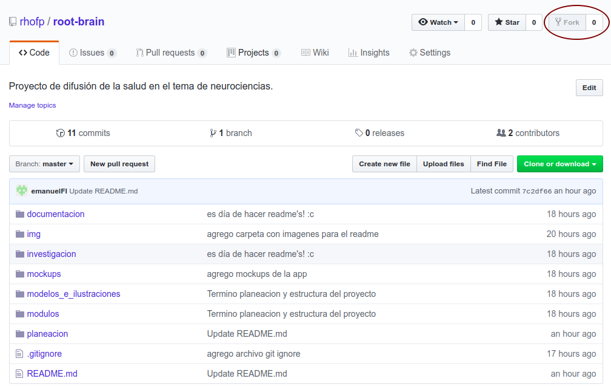

# Git workflow

*Pasos para el trabajo colaborativo en git y gitlab, para poder entregar tareas, proyectos y demás.*

Nota:

Previamente el usuario debe tener instalado git en su sistema operativo de preferencia. Para instalar git pueden seguir las intrucciones que dejo Samuel [aquí](../README.md).

### *Fork* del repositorio principal

Deben realizar un *fork* o copia del repositorio. La copia se hace mediante el botón `Fork` que se encuentra en la esquina superior derecha.



Una vez realizado el fork notarás que, en la parte superior izquierda, en vez de mostrar mi nombre mostrará con tu nombre de usuario.

### Clonar el repositorio

Después de realizar el *fork* deben *clonar* el repositorio.

Para clonar el repositorio tiramos el comando

```shell
$ git clone https://gitlab.com/TuNombreUsuario/curso-androidk
```

### Configura tu copia local para seguir al repositorio raíz

Siempre que vayan a empezar a trabajar en su copia de repositorio tienen que asegurarse que poseen la última versión del repositorio original (o sea el mío) para ello deben indicar a su repositorio que estarán siguiendo una *rama remota*. El comando para ello es el siguiente.

```shell
$ git remote add --track master rhofp https://gitlab.com/rhofp/curso-androidk
```

Bueno, eso de ponerle rhofp no es necesariamente así, podrián ponerle `upstream` por convención. Solo tengan cuidado a la hora de hacer el pull.

Y para tener la versión más actual de la rama `develop` de mi repositorio tendrían que tirar el siguiente comando.

```shell
git pull rhofp master
```

### Comandos básico de git

#### Status

Devuelve los archivos que han sido modificados

```shell
$ git status
```

#### Add

Agrega los archivos que hayan sido modificados.

```
$ git add nombreArchivo
```

#### Commit

Crear un commit 

```shell
$ git commit -m "Mensaje"
```

### Pull request

Trabajaremos todos su avances mediante *pull request* para que un mediador (yo) pueda cuidar la integridad del repositorio de una mejor manera.

Entonces, una vez que subimos nuestra rama a Github deben presionar el botón del **pull request** y el resto es historia ... o sea ya me toca a mi hacer el `merge` de sus cambios.
