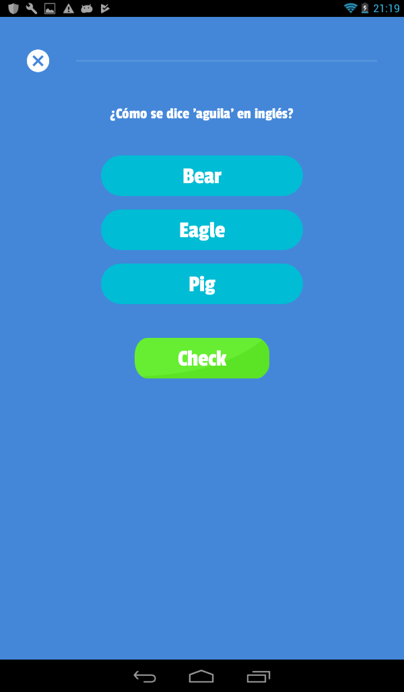
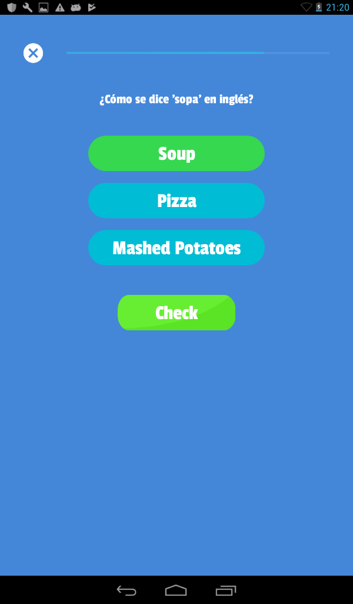

# Proyecto Android Básico
### Nombre: Diego Roberto Medina Martínez

## Introducción

El fin de este proyecto es aplicar los conocimientos adquiridos en el curso de Android realizando una aplicación similar a "Duodingo", donde el usuario podrá registrarse, guardar su progreso y aprender inglés de una manera fácil, gratuita y divertida.

## Problemas a resolver

**1. Inicio de sesión y registro.**
* Si es la primera vez que el usuario inicia la aplicación se le pedirá **ingresar** sus credenciales (usuario y contraseña), en caso contrario se mostrará la **lista de _quizzes_**, es decir, la siguiente vista.

**2. Contenido**
* Ahora bien, la mayor parte del trabajo reside en la lista de quizzes y su contenido.

-   Para empezar, si es la primera vez que se inicia la app, el usuario solo tendrá derecho a realizar el primer quizz ( es el único que debe estar desbloqueado y por lo tanto tener la imagen del candadito desbloqueado).
    
-   Solo deben de estar desbloqueados los quizzes que el usuario ya haya realizado y el siguiente del último que jugó. Es decir, si jugó el tercero quizz, entonces el cuarto queda desbloqueado.
    
-   Además, si ya jugó algún quizz, **su puntaje** debe aparecer abajo del nombre del _quizz_.
    
-   Si el usuario da click en un quizz al que pueda acceder se debe mostrar el siguiente contenido

**3. Preguntas**
* En el contenido del quizz aparecerán 5 preguntas (pueden ser más si gustan) a realizar con sus correspondientes opciones (por lo menos 3), el usuario debe elegir una, cuando lo haga, dicha opción se pondrá en verde y posteriormente el usuario debe dar click en el botón de _check_ para que pueda verificar si contestó correctamente, deben mostrar una mensaje, de cualquier manera que se los ocurra para indicarle al usuario que esta bien o mal y que lo deje continuar hacia la siguiente pregunta.

## Caracteristicas técnicas del proyecto

* Este proyecto es **compatible con Android 4.1 y posteriores** ```(Lo probé en una tablet con Android 4.1 y funcionó correctamente, coloqué en el gradle para que soportara a partir de ésta)```.
* Widgets utilizados: ```ImageView```, ```EditText```, ```ProgressBar```, ```androidx.recyclerview.widget.RecyclerView```, ```RatingBar``` y ```TextView```.

## Lógica de la implementación de las soluciones

**1. Inicio de sesión y registro.**

Para guardar los datos del usuario de manera local se usó SharedPreferences, así cuando éste se registra, pueda iniciar sesión cada vez que lo desee, esto trae como beneficio que si un grupo de personas utiliza un mismo dispositivo puedan hacer uso de la aplicación de manera independiente.
De manera técnica se utilizaron strings para guardar cada uno de los datos mediante siguiente formato:
> La clave para acceder a cada uno de los datos es:
```
nombreDelCampo:emailDelUsuario
```
> Y con esto se obtiene el cambio deseado, ejemplo para obtener el nombre del usuario registrado con el correo diego@gmail.com se utiliza la siguiente clave:
```
nombre:diego@gmail.com   
```
**Nota**: Se tomó en cuenta que el correo es único, así que cada persona tiene un email diferente y no es posible registrarse con el mismo correo en la aplicación.
> Para revisar si ya existia una cuenta se comprueba que exista algún campo como el nombre, apellidos, o el mismo email, por ejemplo revisando que exista la siguiente clave:
```
email:diego@gmail.com
```
> Si esto devuelve algo diferente de nulo, es porque el usuario ya estaba registrado.

**2.  Contenido**

Para el manejo del puntaje y desbloqueo de las actividades, se manejó también ```SharedPreferences``` para guardar estos datos para cada unos de los usuarios registrados, esto se logró utilizando el siguiente formato:
```
actividad:NombreDeLaActividad:email
```
Donde ```NombreDeLaActividad``` representa un nombre único y esto devolverá un dato de tipo ```Float``` el cual representa la puntuación anterior obtenida en esa actividad basada en estrellas. Si esa puntuación es mayor a 2 entonces la siguiente actividad se desbloquea y así sucesivamente. Además de cargarlo al valor de las estrellas para que el usuario pueda visualizarlo.

**3. Preguntas**

Para esto se pasan las preguntas desde ```Index.tk``` hacia ```Content.tk``` usando un intent explicito, sin embargo fue necesario hacer la clase ```Question.tk``` serializable para poder mandar el dato. Para la puntuación se utilizó una variable global que incrementa si el usuario obtiene una respuesta correcta, además de actualizar la barra superior de progreso.

Mediante el uso de eventos especificamente el ```setOnClickListener``` fue como se identificaba cuando el usuario presiona una respuesta y dependiendo del botón se sabe que índice se presionó (0,1,2,...) esto se guarda en una variable y cuando el usuario presiona el boton de check se valida con la respuesta correctaque también está en formato de índice, es decir, un  número entero como si se tratara de arreglos.

Una vez que el usuario presiona el botón check y se valida la respuesta, se coloca de color verde la correcta, y con el uso de las clases ```runOnUiThread```, ```Handler``` y ```Runnable``` se creo un timer de 2 segundos así el usuario tenga tiempo de visualizar su error o acierto.

Por último, al llegar a la última pregunta se calcula el porcentaje de estrellas usando una regla de 3 y se guardar mediante ```SharedPreferences``` así la clase ```Index.tk```  pueda leer el valor posteriormente.

## Conclusión

Este proyecto resultó de bastante utilidad, ya que fue posible aplicar el guardado de datos dentro del dispositivo el cual apesar de que sólo permite datos primitivos no limitó la realización de acciones como el guardado de datos simulando arreglos en este caso con un elemento único, el email del usuario. 
También se comprendió la importancia del uso de intents ya que son esenciales en el paso de datos entre vistas o incluso hacía otras aplicaciones.

## Imagenes








