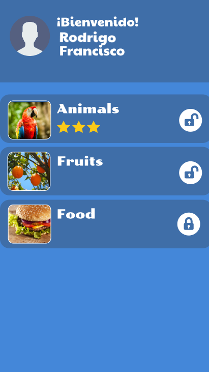
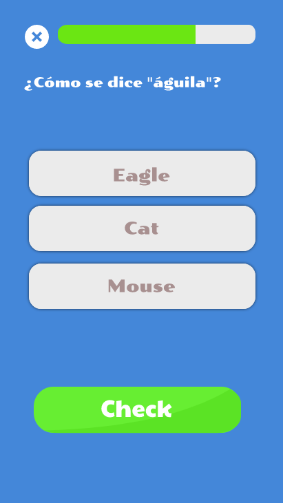
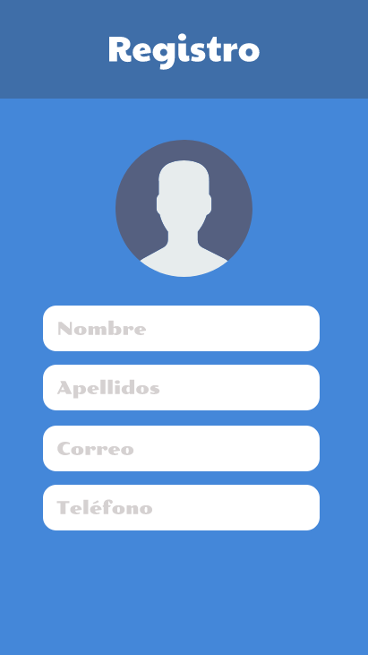
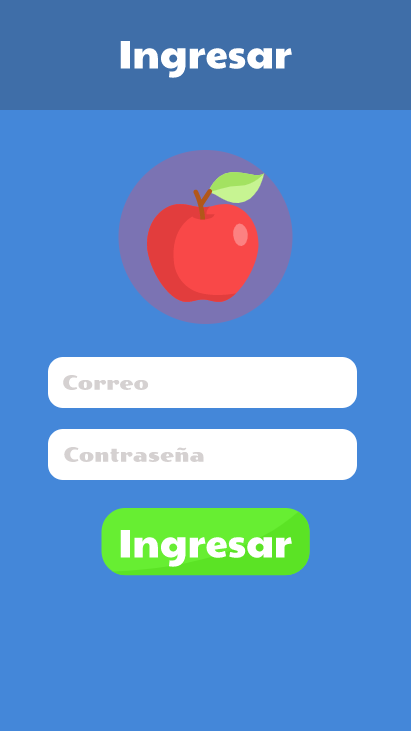
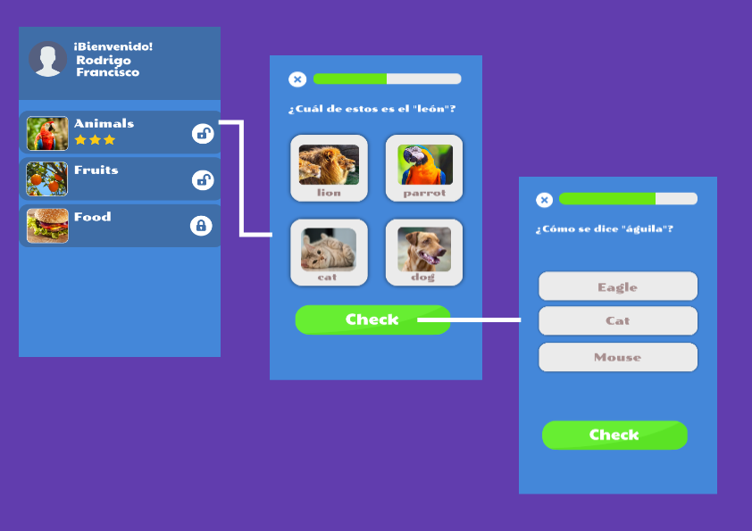

# Proyecto Android 2019-2

```shell
Entrega 
si solo tomo el curso basico
	28 de Junio de 2019
en otro caso
	19 de Julio de 2019
Puede ser en equipos de máximo 2 integrantes
```

## Hello app

Hello es una aplicación que ayuda a los usuarios a aprender el idioma inglés (tal vez con el tiempo se le agreguen otros idiomas) y para hacerlo se apoya de divertidos *quizzes* sobre preguntas relacionadas con el vocabulario en inglés. 

### ¿Qué hay que hacer?

### Para el proyecto de android básico

Para los los que tomaron el curso de android básico tiene que realizar lo siguiente. Como vimos en clase la aplicación debe implementar las siguientes funciones.

* **R1 :** Si es la primera vez que el usuario inicia la aplicación se le pedirá **ingresar** sus credenciales (usuario y contraseña), en caso contrario se mostrará la **lista de *quizzes***, es decir, la siguiente vista.

  

* **R2 :** Ahora bien, la mayor parte del trabajo reside en la lista de quizzes y su contenido.

  * Para empezar, si es la primera vez que se inicia la app, el usuario solo tendrá derecho a realizar el primer quizz ( es el único que debe estar desbloqueado y por lo tanto tener la imagen del candadito desbloqueado).

  * Solo deben de estar desbloqueados los quizzes que el usuario ya haya realizado y el siguiente del último que jugó. Es decir, si jugó el tercero quizz, entonces el cuarto queda desbloqueado.

  * Además, si ya jugó algún quizz, **su puntaje** debe aparecer abajo del nombre del *quizz*.

  * Si el usuario da click en un quizz al que pueda acceder se debe mostrar el siguiente contenido

    

  * **R3 :** En el contenido del quizz aparecerán 5 preguntas (pueden ser más si gustan) a realizar con sus correspondientes opciones (por lo menos 3), el usuario debe elegir una, cuando lo haga, dicha opción se pondrá en verde y posteriormente el usuario debe dar click en el botón de *check* para que pueda verificar si contestó correctamente, deben mostrar una mensaje, de cualquier manera que se los ocurra para indicarle al usuario que esta bien o mal y que lo deje continuar hacia la siguiente pregunta.

### Para el curso de android intermedio y avanzado

Para los asistentes que tomaron el curso de android básico, intermedio y avanzado debe cumplir con los requerimientos del proyecto de android básico y además deben de agregar lo siguiente.

* El cambio más importante que vamos a tener es que ahora tendremos un lugar donde almacenar los datos de la aplicación y este será en **FIREBASE**.

  * ¿Qué vamos a hacer con firebase?

    * **R4 :** Como lo vimos en clase, con *firebase* vamos a crear una manera en la que el usuario se pueda registrar o iniciar sesión utilizando firebase, para ello debemos implementar las siguientes dos vistas (dichas vistas fueron realizadas en el curso de android básico) y darles funcionalidad.

      

      

  * Más de *firebase*, multimedia, gridview

    * **R5 :** Ahora que tenemos más herramientas para hacer una aplicación funcional, hay que sacarle provecho, la idea es hacer nuestro curso de idiomas al estilo *Duolingo*, entonces nuestras lecciones de inglés tienen que ser muchisimo mejores, ¿cómo hacemos esto? Veamos que debe tener cada una de las lecciones que se muestra en el *recyclerView*  (veáse *lista de quizzes* del **R1 **)

      
      
      Las lecciones deben de tener un *gridview* que muestre imagenes y nombres de animales, dichas imágenes y nombres deben de ser traidos de firebase.

### Consideraciones técnicas

* Deben modificar la clase *QuizItem* y ponerle un  campo llamado **id**, lo necesitarán para identificar que cuestionario elegió el usuario y mostrar el contenido relacionado con dicho quizz. Así mismo dicho id les servirá para almacenarlo en *SharedPreference* y hacer persistente la información sobre los cuestionarios que el usuario la contestó.

Intentáre ir realizando el proyecto y conforme me salgan algunos tips se los haré llegar.

### Entrega

* Máximo en equipos de 2 personas.

* En proyecto se entrega como las tareas; tendrán que crear una carpeta con el nombre de los integrantes en el directorio de proyectos, es decir, deberán tener por ejemplo

  ```shell
  proyectos/RiveraArmando-SaldañaNorman
  
  ó
  
  proyectos/RiveraArmando
  
  ```

* Deben entregar documentación del proyecto, misma que debe de estar en la carpeta que lleva su nombre. En la documentación deben de explicar la lógica que los llevo a implementar la solución del problema, la versión de cada una de las tecnologías que ocuparon y para que versiones del sistema operativo android lo puedo ocupar. Así mismo deben de incluir pantallazos de como quedo la aplicación y de ser posible un par de GIFs que muestren su funcionamiento (si quieren pueden poner un video en lugar GIFs).  Así mismo no olviden darle los créditos a quién los merece si en algún punto ocuparon código de alguien más. Les recomiendo utitlizar markdown para hacer sus documentación.
* Además de documentado, su código debe estar comentado para que me sea más fácil entender que hicieron.

Sin más por el momento, y esperando no haber olvidado algo (si sí haganmelo saber) les deseo buena suerte y **HAPPY CODING!** 

Estoy a sus ordenes a través del correo rhodfra.proteco@gmail.com y en Telegram con el usuario [@rhofp](https://t.me/rhofp)

Redacté primero el proyecto y en seguida redacto la tarea, tenganme un poco de paciencia.