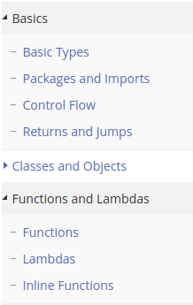

# Tarea 1

## Lunes 22 de octubre 

1. **Instalar Android studio en su sistema operativo de confianza (Punto extra si lo hacen en GNU/Linux) **

2. **Realizar el hola mundo en android (usando kotlin)**

3. ¿Qué es android?

4. ¿Qué es Android SDK?

5. ¿Qué es la Open HandSet Alliance?

6. ¿Quién es Andy Rubin?

7. Investiga la historia de android

8. ¿Cuál es el nombre de la mascota de Android y por qué tiene ese nombre?

9. ¿Qué es “Android Developers” y por qué es tu mejor amigo? ¿Cómo se usa?

10. ¿Qué tipo de arquitectura de diseño soporta Android? (MVC, MVP, MVVM, etc)

11. Características de Android 9

12. ¿Cuáles son las versiones de android más utilizadas actualmente y donde consigo esa información?

13. Describir ampliamente la arquitectura del sistema operativo Android (Linux Kernel,HAL,Librerías nativas, ART,API de Java)

14. ¿Qué es Dalvik?

15. ¿Qué es un AVD?

16. Describe la estructura básica de un proyecto en android

17. ¿Qué es el android manifest?

18. ¿Qué es el directorio drawable y que se guarda allí?

19. ¿Qué son los archivos dex?

20. ¿Qué es la clase R?

21. ¿Qué es un archivo apk?

22. ¿Qué es XML?

23. ¿Qué es un layout?

24. ¿Qué es un widget en Android? Menciona algunos de ellos. NOTA: me refiero a widget como la subclase de View, no confundir con App Widget.

25. Describe ampliamente los siguientes views o viewGroups (FrameLayout, LinearLayout, RelativeLayout, TableLayout, GridLayout y AbsoluteLayout). Todas las preguntas son importantes, pero esta en especial lo es más ya que de esto tratará la primera clase.

26. ¿Qué son los dp, los sp, los dpi y los px?

27. **Para el martes**. (se las dejo de una vez para que tengan el fin de semana para estudiarlo bien). El curso no se dará utilizando Java para el backend, en lugar de ello utilizaremos algo mejor, Kotlin. Necesito que se empiecen a conocer la sintaxis del lenguaje por sí mismos. Para ello mi recomendación es que utilicen la documentación oficial que se encuentra en https://kotlinlang.org/docs/reference/control-flow.html 

    Además, Kotlin ofrece un playground para probar nuestros código, es altamente recomendable que lo usen. A propósito, investiguen que es un play ground. https://bit.ly/2PAynMJ.

    Deben de revisar todos los puntos de la imagen de abajo.

     

    ### Extras

    1. ¿Qué es una arquitectura de diseño?
    2. ¿Qué es un cvs? 
    3. ¿Qué es Mercurial?
    4. ¿Qué es bitbucket?
    5. ¿Qué es gitlab?
    6. ¿Qué es un pull request en github?
    7. ¿Qué es un issue en github?
    8. ¿Qué es un gist?
    9. ¿Qué es Gitlab?
    10. ¿Qué es Github Classroom? 
    11. ¿Qué es Markdown?
    12. ¿Qué es github education y qué ofrece?